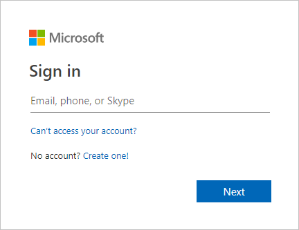
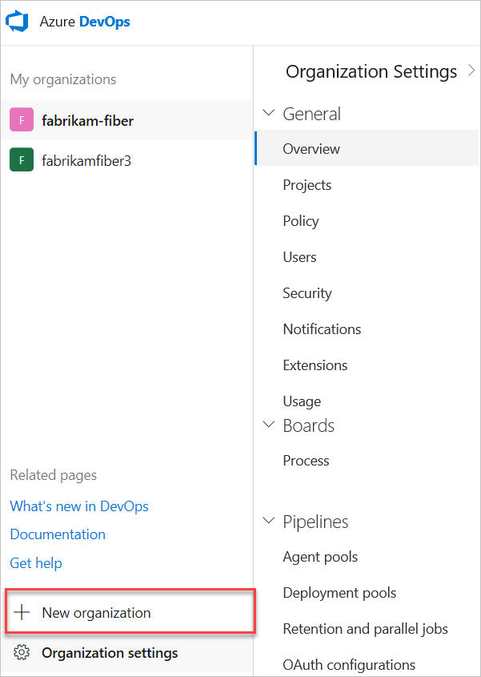
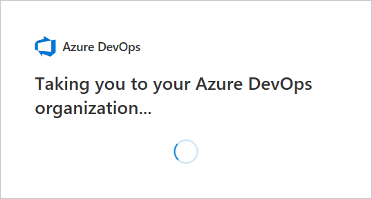

ms.topic: include
---

## Create an organization

1. Go to [Azure DevOps](https://go.microsoft.com/fwlink/?LinkId=307137), and use either a Microsoft, GitHub, or Azure AD account to sign in. Choose **Next**.

	  

	  If you previously signed up for Azure DevOps, select **New organization**.

      

2. Enter the name of your organization. The name can't contain spaces or special characters
 (such as / \ [ ] : | < > + = ; ? or &#42;), can't end in a period or comma, must be fewer than 256 characters, and must be unique within the DevOps namespace. You can also choose between several locations for where you want your data hosted. Select **Continue**.

   

   

   Congratulations, you're now an organization owner!

To sign in to your organization at any time, go to (https://dev.azure.com/{yourorganization}).

