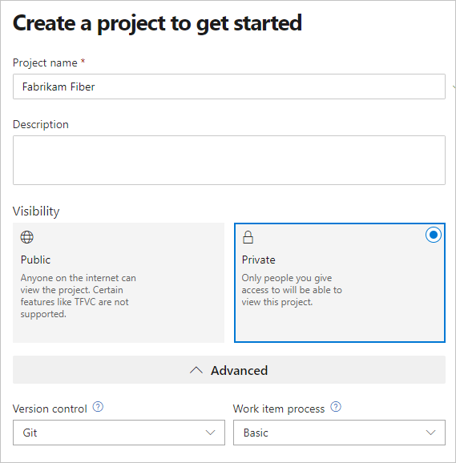
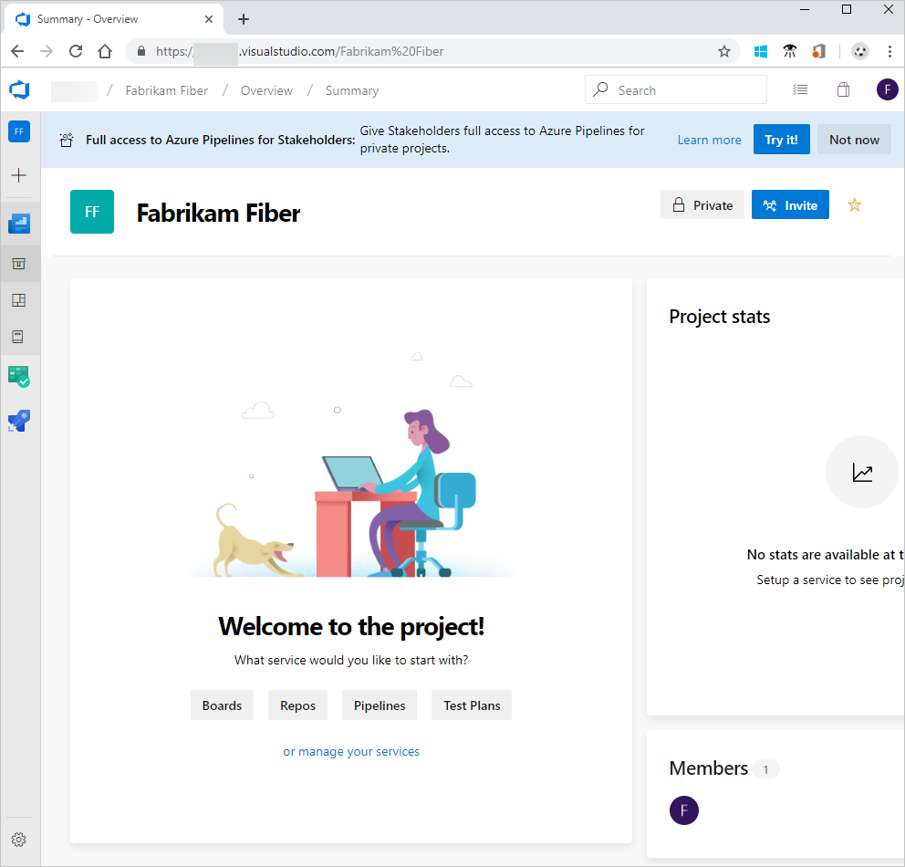

## Create a project

If you signed up for Azure DevOps with a Microsoft account (MSA), your project is automatically created and named.

If you signed up for Azure DevOps with an account other than an MSA, you're automatically prompted to create a project.   

1. Enter information into the form provided, which includes a project name, description, visibility selection, initial source control type, and work item process.
 
    

   See [choosing the right version control for your project](../repos/tfvc/comparison-git-tfvc.md) and [choose a process](../boards/work-items/guidance/choose-process.md) for guidance.  

2. When your project is complete, the welcome page appears.
 
   >

