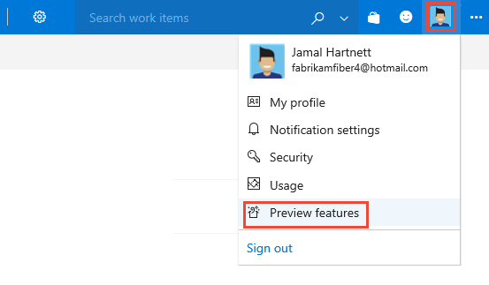
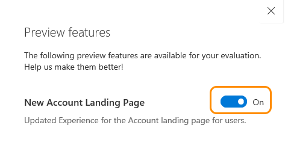

### Turn preview features on or off  

From time to time, a new feature is introduced in Preview mode, which allows you to turn it on or off. 

To enable or disable a feature in preview, access the Preview features option from your user account menu. 

 

Here, the New Account Landing page has been enabled. 

 

 
