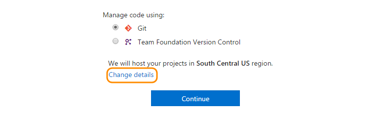
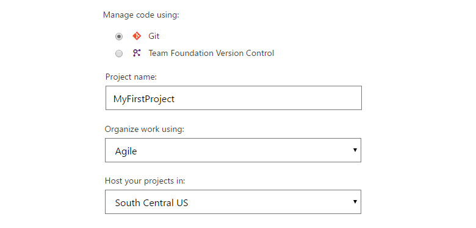

#### Q: How do I find the region where my VSTS account is located? 

A: [Find your account's region](../organizations/accounts/change-account-location.md)

#### Q: How do I change my team project name, account location, or process? 

A:	Change these when you sign up for your VSTS account. 

VSTS uses Agile as the default 
[process](https://msdn.microsoft.com/Library/vs/alm/work/work-items/guidance/choose-process) 
to organize your work. And your account's default location is based on the closest 
[Microsoft Azure region](https://azure.microsoft.com/regions) 
where VSTS is available. For a better experience, 
select a location that's closest to most users in your account. If a new VSTS region or location opens later, you can 
[change your account location or region](../organizations/accounts/change-account-location.md).
You can select another process, like Scrum, if that works best for you.

If you connected your VSTS account to an organization's directory in Azure Active Directory, 
but you belong to multiple directories and want to select a different directory, 
change your directory here:

