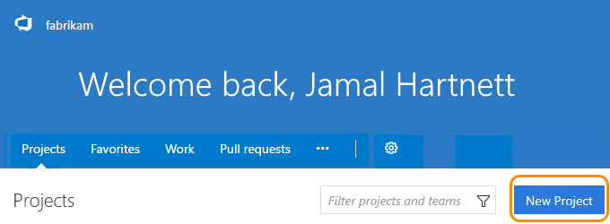

####Q:	Can I create more than one team project?

A:	Yes, multiple team projects help you keep work separate when 
you have development projects for different teams. 
VSTS currently supports one team project collection.

To create team projects, you'll need VSTS 
project collection administrator or account owner permissions. 

If you've [turned on the Account Landing preview](../user-guide/account-home-pages.md), 
go to your **Projects** page (```https://{youraccount}.visualstudio.com/_projects```).

Projects page:



Your account home page is associated with your team project collection, and not any single team project or team. 
