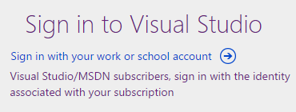
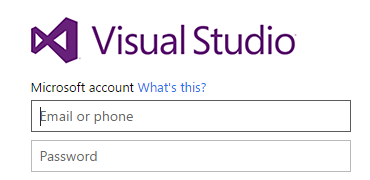

*	Choose **Work or school account** if you used this identity 
to create your VSTS organization or signed in with this 
identity before. For example, choose this option if you used to sign in to VSTS here:

	

	Your identity is authenticated by your organization's 
	directory in Azure Active Directory (Azure AD), 
	which controls access to your VSTS organization.

*	Choose **Personal account** if you used your Microsoft account with VSTS. 
	For example, choose this option if you used to sign in to VSTS here:

	

	Your identity is authenticated by the global directory for Microsoft accounts.

