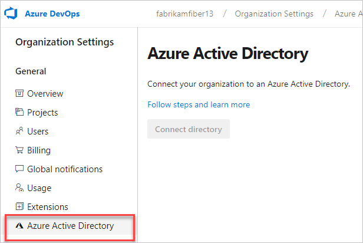
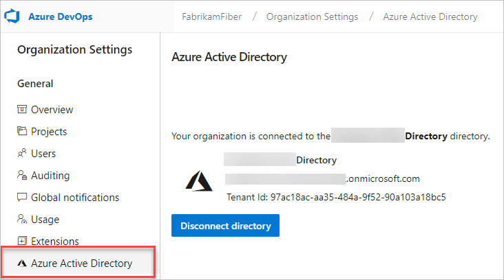

### Q: How do I find out whether my organization uses Azure AD to control access?

A: If you have at least Basic access, here's how to find out:

Go your **Organization settings**, and then select the **Azure Active Directory** tab.
See the following examples of an organization that is not connected, and then an organization that is connected to Azure AD.

**Not connected**

**Connected**

If your organization is connected to your organization's directory, only users from your organization's directory can join your organization. Learn [how to control organization access by using Azure AD](/azure/devops/organizations/accounts/add-users-to-aad).
