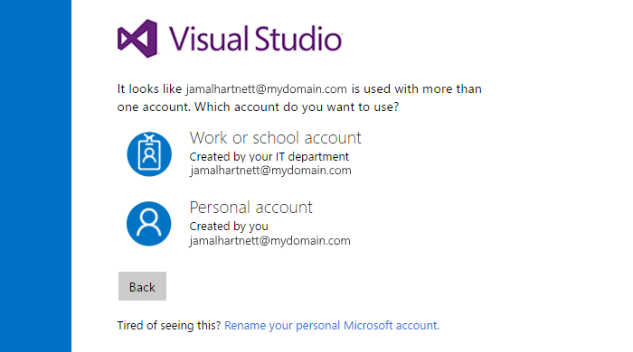

#### Q:	Why don't I see the VSTS organizations that I own after I sign in to my Visual Studio profile on visualstudio.com?

A:	The list of organizations that you own are 
associated with the identity that you use 
to sign in to VSTS. 

If you were asked to choose between your personal Microsoft account, 
or your work or school account when you signed in, 
you might have selected the wrong identity. 

Please try signing out completely from VSTS, 
then sign in again, and select your other identity.

Here's how you can sign out completely because 
just closing your browser doesn't always sign you 
out completely from VSTS:

0.	Close all browsers, including those that aren't running VSTS.

0.	Open a private or incognito browsing session. 

0.	Go to this URL: http://aka.ms/vssignout

	You'll get a message that says "Sign out in progress". 
	After you're signed out, you're redirected to the 
	Visual Studio page @visualstudio.microsoft.com. 

	**Tip** If the sign-out page takes more than a minute, 
	close the browser, and continue.

0.	Sign in to VSTS 
Select your other identity.
