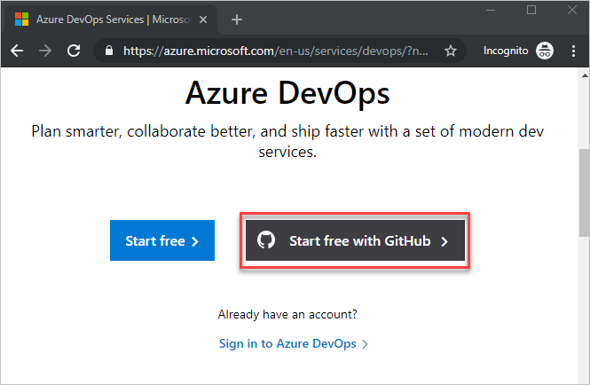
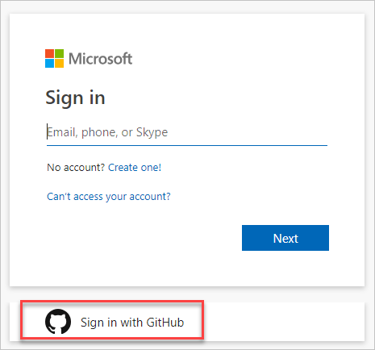

## Sign up for Azure DevOps with a GitHub account

> [!IMPORTANT]
> If your GitHub email address is associated with an Azure AD-backed organization in Azure DevOps, you can't sign in with your GitHub account, rather you must sign in with your Azure AD account.

1. Select the sign-up link for [Azure DevOps](https://azure.microsoft.com/en-us/services/devops/), **Start free with GitHub**. If you're already part of an Azure DevOps organization, select **Sign in to Azure DevOps**.

   

2. Select **Sign in with GitHub**.

     

   If you have an account in session already, select **Use another account**. You're taken to GitHub sign-in where you can enter your GitHub user name or email address.

3. Enter your GitHub account credentials, and then select **Sign in**.

   

4. Select **Authorize Microsoft corporation**.

   

5. To get started with Azure DevOps, select **Continue**.

   

An organization is created based on the account you used to sign in. Sign in to your organization at any time, (`https://dev.azure.com/{yourorganization}`).

You can rename and delete your organization, or change the organization location. To learn more, see [Manage organizations](../organizations/accounts/organization-management.md).

