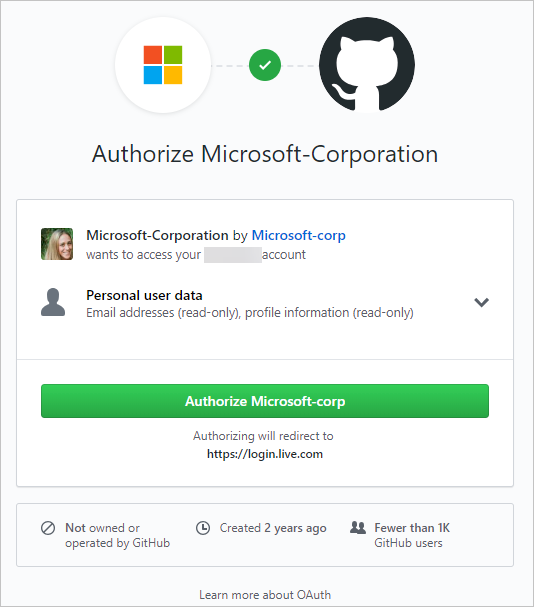

## Sign up for Azure DevOps with a GitHub account

> [!IMPORTANT]
> If your GitHub email address is associated with an Azure AD-backed organization in Azure DevOps, you can't sign in with your GitHub account, rather you must sign in with your Azure AD account.

1. From the [Azure DevOps](https://go.microsoft.com/fwlink/?LinkId=307137) site, select **Start free with GitHub**. If you're already part of an Azure DevOps organization, select **Sign in to Azure DevOps**.

   

2. Select **Sign in with GitHub**.

    

   If you have an account in session already, select **Use another account**. You're taken to GitHub sign-in where you can enter your GitHub user name or email address.

3. Enter your GitHub account credentials, and then select **Sign in**.

   

4. Select **Authorize Microsoft corporation**.

   

5. To get started with Azure DevOps, select **Continue**.

   

6. Enter a name for your organization. The name can't contain spaces or special characters
 (such as / \ [ ] : | < > + = ; ? or &#42;), can't end in a period or comma, must be fewer than 256 characters, and must be unique within the DevOps namespace. You can also choose between several locations for where you want your data hosted. Select **Continue**.

   

   You see the following dialog box as your organization is created.

   

	Congratulations, you're now an organization owner!

	To sign in to your organization at any time, go to `https://dev.azure.com/{yourorganization}`.

