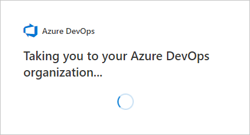
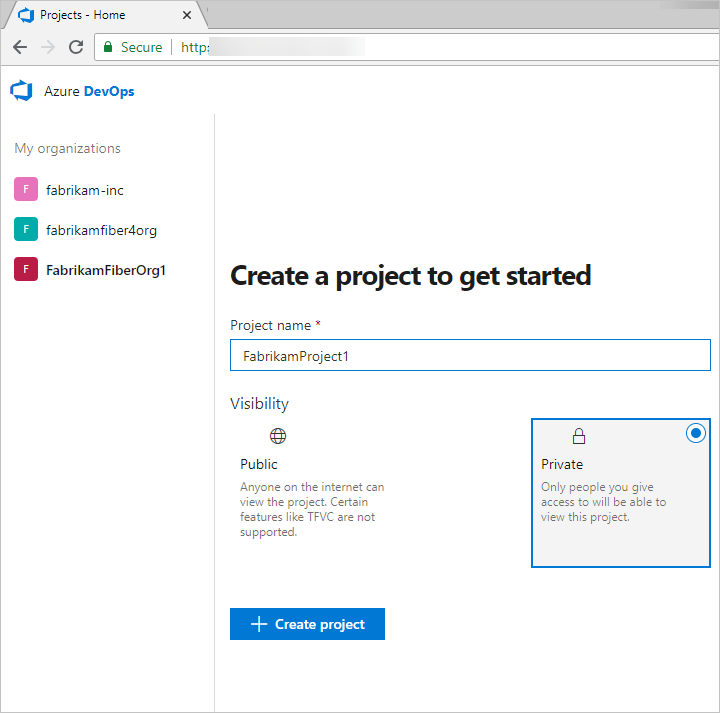
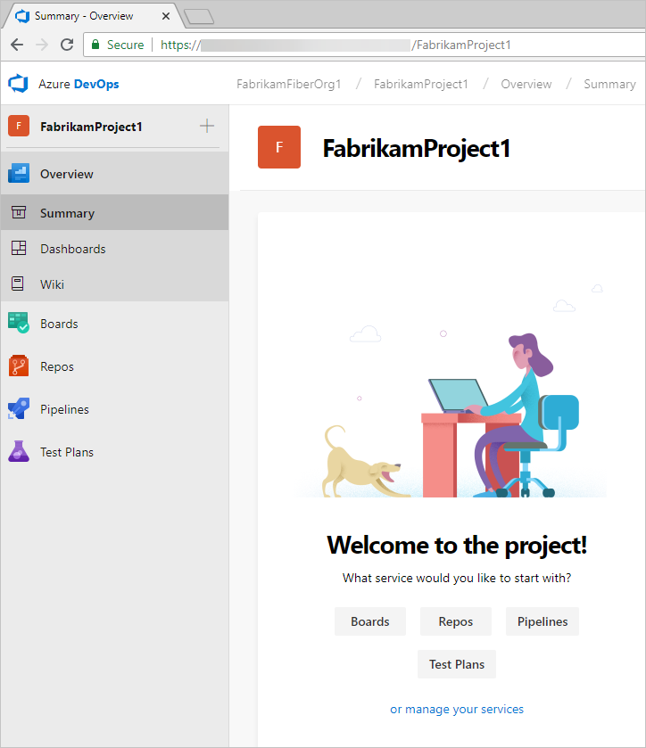

## Sign up for Azure DevOps with a personal Microsoft account

1. Select the sign-up link for [**Azure DevOps**](https://go.microsoft.com/fwlink/?LinkId=307137).

2. Enter your email address, phone number, or Skype ID for your Microsoft account. If you're a Visual Studio subscriber and get DevOps as a benefit, use the Microsoft account associated with your subscription. Choose **Next**.

   

3. Enter your password, and choose **Sign in**.

   If you don't have a Microsoft account, you can [create a Microsoft account](https://login.live.com/login.srf?lw=1) at this time.

   

4. To get started with Azure DevOps, choose **Continue**.

   

5. Enter a name for your organization. The name you enter cannot contain spaces or special characters
 (such as / \ [ ] : | < > + = ; ? or *), cannot end in a period or comma, must be less than 256 characters, and must be unique within the DevOps namespace. You can also choose between several locations for where you want your data hosted. Choose **Continue**.

   

   You'll see the following dialog as your organization is created.

   

Congratulations, you're now an Azure DevOps organization owner!
To sign in to your organization at any time, go to https://dev.azure.com/{yourorganization}.

5. Enter a project name and select the visibility. The name you enter cannot contain spaces or special characters (such as / : \ ~ & % ; @ ' " ? < > | # $ * } { , + = [ ], cannot begin with an underscore or begin or end with a period, and must be 64 characters or less. Visibility can either be public or private. With public visibility, anyone on the internet can view your project. With private visibility only people you give access to will be able to view your project. Choose **Create project**.

    

For more information about organizations and projects, read [Define organizations and projects](../user-guide/define-organizations-and-projects.md) and [Create a project](../organizations/projects/create-project.md).

