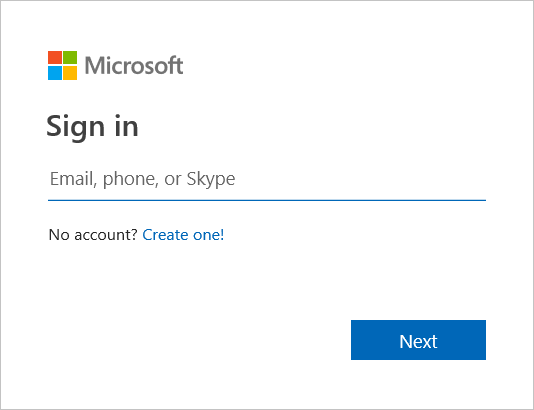
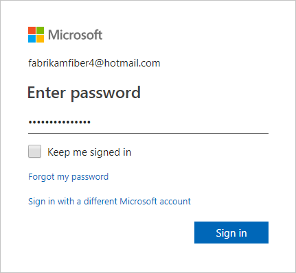
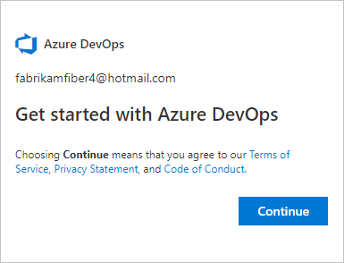
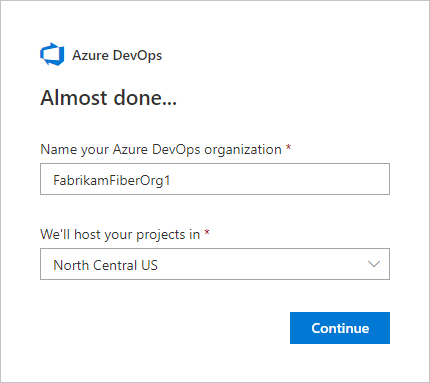

## Sign up for Azure DevOps with a personal Microsoft account

1. Select the sign-up link for [Azure DevOps](https://go.microsoft.com/fwlink/?LinkId=307137).

2. Enter your email address, phone number, or Skype ID for your Microsoft account. If you're a Visual Studio subscriber and you get Azure DevOps as a benefit, use the Microsoft account associated with your subscription. Select **Next**.

   

3. Enter your password and select **Sign in**.

   If you don't have a Microsoft account, you can [create a Microsoft account](https://login.live.com/login.srf?lw=1) at this time.

   

4. To get started with Azure DevOps, select **Continue**.

   

5. Enter a name for your organization. The name can't contain spaces or special characters
 (such as / \ [ ] : | < > + = ; ? or &#42;), can't end in a period or comma, must be less than 256 characters, and must be unique within the DevOps namespace. You can also choose between several locations for where you want your data hosted. Select **Continue**.

   

   You see the following dialog box as your organization is created.

   

	Congratulations, you're now an organization owner!

	To sign in to your organization at any time, go to `https://dev.azure.com/{yourorganization}`.

6. Enter a name for your project and select the visibility. The name can't contain special characters (such as / : \ ~ & % ; @ ' " ? < > | # $ &#42; } { , + = [ ]), can't begin with an underscore, can't begin or end with a period, and must be 64 characters or less. Visibility can be either public or private. With public visibility, anyone on the internet can view your project. With private visibility, only people who you give access to can view your project. Select **Create project**.

    

<!---
For more information about organizations and projects, see the following articles: 
- [Define organizations and projects](/azure/devops/user-guide/define-organizations-and-projects)
- [About projects and scaling your organization](/azure/devops//organizations/about-projects)
- [Create a project](/azure/devops/organizations/projects/create-project).

-->
