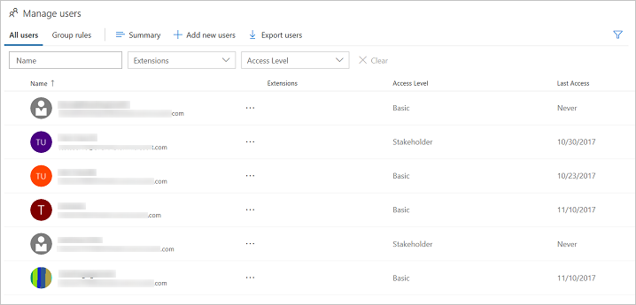
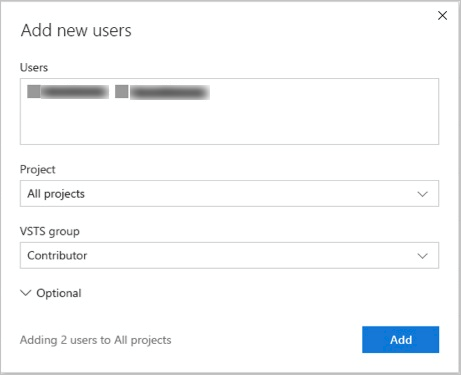

#	Add users to your Visual Studio Team Services (VSTS) account or team project 

**VSTS**

Add users to your VSTS account and specify the level of features they can use, such as Basic or Stakeholder.  
These kinds of users can join your VSTS account for free:

*	5 users who get [Basic features](https://www.visualstudio.com/team-services/compare-features/), 
such as version control, tools for Agile, Java, build, release management, and more
*	Unlimited users who get [Stakeholder features](https://www.visualstudio.com/team-services/compare-features/), 
such as working with your backlog, work items, and queries
*	Unlimited [Visual Studio subscribers](https://www.visualstudio.com/team-services/compare-features/) 
who also get Basic features, and in some cases, additional features with specific extensions, such as 
[Test Manager](https://marketplace.visualstudio.com/items?itemName=ms.vss-testmanager-web) 

[Need more users with Basic features or Visual Studio subscriptions?](add-basic-or-vs-subscription-users.md)

> [!NOTE]   
> You can add people to team projects, 
> rather than to your account. VSTS automatically assigns them 
> [Basic features](https://www.visualstudio.com/team-services/compare-features/), 
> if your account has seats available, 
> or [Stakeholder features](https://www.visualstudio.com/team-services/compare-features/), 
> if not. Learn [how to add members to team projects](add-team-members-vs.md).
>
> When people don't need access to your VSTS account anymore, [delete them](delete-account-users-users-hub.md) from your account. 

## How does *access* differ from *permissions*?

Access levels control which features are available to users, while permissions control their access to account resources. To learn more, see [Default permissions and access](../security/permissions-access.md). 

## Prerequisites

You'll need [VSTS project collection administrator or account owner permissions](../security/set-project-collection-level-permissions.md?toc=/vsts/accounts/toc.json&bc=/vsts/accounts/breadcrumb/toc.json).  

##	Add users to your VSTS account

Administrators can now add users to an account, grant access to appropriate tooling extensions and service access level, 
and add users to groups all in one view. You can add up to 50 users at once.  You can add more than 50 users by repeatedly 
using this Users view.  When you add users, each receives a notification email with a 
link to the account page.

 > [!NOTE]
 > If have an Azure Active Directory (Azure AD) backed VSTS account, and you need to add users who are 
 > external to your Azure AD, first 
 > [add those users as foreign principals](https://docs.microsoft.com/azure/active-directory/active-directory-create-users#add-a-user) to 
 > your Azure AD.  Be sure on the **Tell us about this user page**, under **Type of user**, to choose **User with an 
 > existing Microsoft account**.  After completing those steps, follow the steps below to add the foreign Azure AD 
 > user to VSTS.

You provide others access to your account by adding their email address. 

0. Turn on **Streamlined User Management** for your account. 

	> [!NOTE] 
	> **Streamlined User Management** is in preview. Turning it on now shows you how to enable preview features, and also provides you access to the enhanced user interface for managing users. 

	a. From your user account menu (you'll see a letter or an image of your profile), choose the **Preview features** option.   
	
	 

	b. In the first drop-down menu, choose the option for all accounts. 

	 

	>[!TIP]  
	>If you don't see the user/account menu option, then you aren't an account administrator. 

	c. Enable the **Streamlined User Management** option. 

	

	Choose the close icon ( to close the preview features dialog window. 

0. Choose , the gear Settings icon, and choose the **Account Settings** option.
 
	

0. Then, choose **Users** to open the Manage users page. Choose **Add new users** to open the dialog. 

	

0. Fill out the form. 
 
	

	- **Users**: Enter the email address (Microsoft account address) for the user account. You can add several email addresses by separating them with a semicolon (;). Note that the email addresses display in red when they are accepted.  
		
        > [!NOTE]   
		> You must add email addresses for 
		> ["personal" Microsoft accounts](https://www.microsoft.com/account) 
		> unless you plan to use [Azure Active Directory (Azure AD)](https://azure.microsoft.com/documentation/articles/active-directory-whatis/) 
		> to authenticate users and control account access.  
		> If your users don't have Microsoft accounts, 
		> have them [sign up](https://signup.live.com/). 
  
	- **Access level**: Leave the Access level at **Basic** for those users who will contribute to the code base. To learn more, see [About access levels](../security/access-levels.md). 
	- **Add to projects**: Select the project that you named in the previous procedure. 
	- **VSTS Groups**: Leave this entry at Project Contributors, the default security group for people who will contribute to your project. To learn more, see [Default permissions and access assignments](../security/permissions-access.md). 

0. Choose **Add** to complete your invitation. 

<!---
Go to the User Hub:

Choose **Add new users** below "Manage users".

Then fill in the "Add new users" dialog:

Next steps: [Manage users in table view](manage-users-table-view.md)
-->

## Related notes

- [Connect to a team project](../user-guide/connect-team-projects.md)
- [Change individual permissions, grant select access to specific functions](../security/change-individual-permissions.md)
- [Grant or restrict access to select features and functions](../security/restrict-access.md)
- [Delete users from VSTS](delete-account-users.md)
- [Troubleshoot adding and deleting account users in the VSTS user hub](faq-add-delete-users.md)
- [Troubleshoot adding members to team projects in Visual Studio Team Services (VSTS)](faq-add-team-members.md)