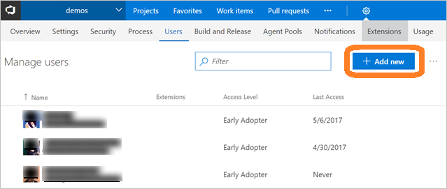

#	Add account users for Visual Studio Team Services (VSTS)

**VSTS**

Add users to your VSTS account and specify the level of features they can use, such as Basic or Stakeholder.  
These kinds of users can join your VSTS account for free:

*	5 users who get [Basic features](https://www.visualstudio.com/team-services/compare-features/), 
such as version control, tools for Agile, Java, build, release management, and more
*	Unlimited users who get [Stakeholder features](https://www.visualstudio.com/team-services/compare-features/), 
such as working with your backlog, work items, and queries
*	Unlimited [Visual Studio subscribers](https://www.visualstudio.com/team-services/compare-features/) 
who also get Basic features, and in some cases, additional features with specific extensions, such as 
[Test Manager](https://marketplace.visualstudio.com/items?itemName=ms.vss-testmanager-web) 

[Need more users with Basic features or Visual Studio subscriptions?](add-basic-or-vs-subscription-users.md)

> You can add people to team projects, 
> rather than to your account. VSTS automatically assigns them 
> [Basic features](https://www.visualstudio.com/team-services/compare-features/), 
> if your account has seats available, 
> or [Stakeholder features](https://www.visualstudio.com/team-services/compare-features/), 
> if not. Learn [how to add members to team projects](add-team-members-vs.md).
>
> When people don't need access to your VSTS account anymore, [delete them](delete-account-users-users-hub.md) from your account. 

## How does *access* differ from *permissions*?

Access levels control which features are available to users, while permissions control their access to account resources. 
[Can't access some features?](faq-add-delete-users.md#feature-access) 
For TFS, learn [how to change access levels](../security/change-access-levels.md) 
or [buy more access to TFS or the Test hub](../billing/buy-access-tfs-test-hub.md). 

To control access to account resources instead, learn [how to add permissions](../security/add-users-team-project.md) or 
[restrict permissions](restrict-access-tfs.md).  To change how many users can access paid extensions in your 
VSTS account, 
learn [how to change paid extension users](../billing/change-number-paid-extension-users.md).

## Required Permissions

You'll need [VSTS project collection administrator or account owner permissions](faq-add-delete-users.md#find-owner). 

##	Add users to your VSTS account

Administrators can now add users to an account, grant access to appropriate tooling extensions and service access level, 
and add users to groups all in one view. You can add up to 50 users at once.  You can add more than 50 users by repeatedly 
using this Users view.  When you add users, each receives a notification email with a 
link to the account page.

 > [!NOTE]
 > If have an Azure Active Directory (Azure AD) backed VSTS account, and you need to add users who are 
 > external to your Azure AD, first 
 > [add those users as foreign principals](https://docs.microsoft.com/en-us/azure/active-directory/active-directory-create-users#add-a-user) to 
 > your Azure AD.  Be sure on the **Tell us about this user page**, under **Type of user**, to choose **User with an 
 > existing Microsoft account**.  After completing those steps, follow the steps below to add the foreign Azure AD 
 > user to VSTS.

[Manage users in table view](manage-users-table-view.md)

## Troubleshooting

[Troubleshooting](faq-add-delete-users.md)

