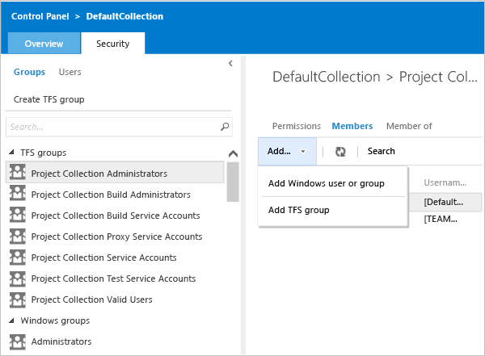

# Add administrators to project collections

**VSTS**

In TFS and VSTS, each team project collection is its own grouping
of projects that can share reports, work items, and other items, all stored in a single database.
Project collection administrators maintain the collection and administer permissions and security
for other roles at the collection level.  [Learn more](../security/set-project-collection-level-permissions.md) about project collection permissions.

1.  Open the web portal and switch to administration mode by choosing the gear icon .

2.  Navigate to security at the collection level, and add a member to **Project Collection Administrators**.

    

### SharePoint

If your deployment is integrated with SharePoint Products,
add team project collection administrators to the site collection administrators group in SharePoint Products.

1.  Open SharePoint Central Administration.

2.  Grant permissions that are appropriate for this user at the farm or the Web application level, depending on your security needs.

    For optimum interoperability, consider adding users of the **Project Collection Administrators** group to the **Site Collection Administrators** group in SharePoint Products.

    

### Reporting Services

If your deployment is integrated with Reporting Services,
add team project collection administrators to the Team Foundation Content Manager group
in SQL Server Reporting Services.

1.  Open Internet Explorer running as an administrator.

2.  In the Address bar, specify the following URL, where *ReportServer* is the name of the server that is running Reporting Services: **http://***ReportServer***/Reports/Pages/Folder.aspx**

    >**Important:**
    >  If you are using a named instance, you must include its name in the path of the reports. You use the following syntax, where *ReportServer* is the name of the report server for Team Foundation and *InstanceName* is the name of the instance of SQL Server: **http://***ReportServer***/Reports_***InstanceName***/Pages/Folder.aspx**

3.  On the **Home** page, choose **Folder Settings**, and add the user by granting them the Team Foundation Content Manager role as a new role assignment.

    

