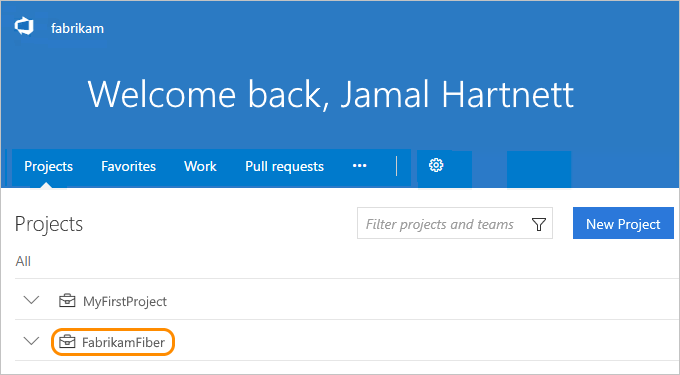
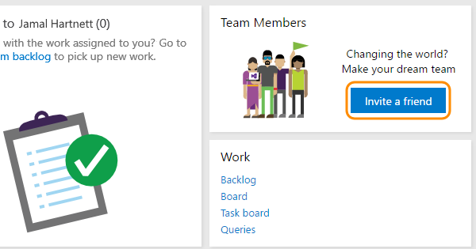
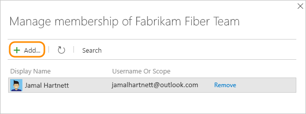
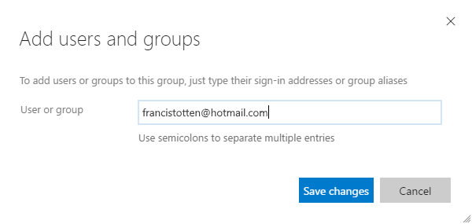
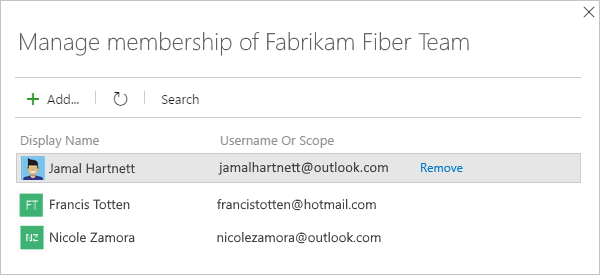

#	Add team project members in VSTS

**VSTS**

Add members to your team project in VSTS, 
so you can share code and work with your team, track their status, 
coordinate dev, build, test, and release activities, and more. 
For Team Foundation Server, learn [how to add team project members here](../security/add-users-team-project.md).

When you add members to team projects, 
VSTS automatically assigns 
[Basic access](https://www.visualstudio.com/team-services/compare-features/), 
if your account has seats available, 
or [Stakeholder access](https://www.visualstudio.com/team-services/compare-features/), 
if not. When a [Visual Studio subscriber](https://www.visualstudio.com/products/subscriber-benefits-vs) 
signs in, they'll get Basic access, and in some cases, additional features with specific extensions, 
like [Test Manager](https://marketplace.visualstudio.com/items?itemName=ms.vss-testmanager-web). 

> [!NOTE]   
> To manually assign access levels, 
> [add members to your account instead](add-account-users-assign-access-levels.md). 
> To control access to account resources, see [Change individual permissions, grant select access to specific functions](../security/change-individual-permissions.md) or [Grant or restrict access to select features and functions](../security/restrict-access.md).

## Prerequisites 

If you don't have a team project yet, 
[create your team project first](../user-guide/connect-team-projects.md).
To add members to team projects, you'll need 
[project administrator](../security/set-project-collection-level-permissions.md), 
[project collection administrator, or account owner](faq-add-team-members.md#find-pca-owner) permissions.

## Add members to your team project

0.	Sign in to your VSTS account 
(```https://{youraccount}.visualstudio.com```) 
as project administrator, project collection administrator, or account owner.

	[Why am I asked to choose between my "work or school account" and my "personal account"?](faq-add-team-members.md#ChooseOrgAcctMSAcct)

0.	On the account landing page (which is your projects page, ```https://{youraccount}.visualstudio.com/_projects```), 
find and select your team project.

	

0.	Invite members to your new team project...

    

	Or invite them to an existing team project.

	
	
  Adding members from the project page adds them to the default team for the project.  To add a member to a different team, choose 
  the gear cog and **Security** from the menu.  Then find the team on the left pane of the security page and select it.  In 
  the right pane, choose the **Members** view (next to **Permissions**), and then you will see a green plus symbol and 
  the **Add...** button.

0.	Add your team members.
	 
	
	
0.	Enter the email addresses for your new users. 
Otherwise, enter the display names for existing users. 
Add them one at a time or all at once.

	Which email addresses can I add?
	 * If your VSTS account is Azure Active Directory backed, then you can only add email addresses that are
	 internal to the tenant.
	
	 * You must add email addresses for users who have ["personal" Microsoft accounts](https://www.microsoft.com/account) 
	unless your VSTS account [uses your organization's directory](faq-add-team-members.md#ConnectedDirectory) 
	to authenticate users and control account access through 
	[Azure Active Directory (Azure AD)](https://azure.microsoft.com/en-us/documentation/articles/active-directory-whatis/). 
	If new users don't have Microsoft accounts, have them [sign up](https://signup.live.com/).

 	 * If your VSTS account is connected to your organization's directory, 
	all users must be directory members and sign in to VSTS with "work or school accounts" that are managed by 
	your organization's directory. 	If they're not members, have a directory administrator add them to the directory. 
	That way, you can find them in this directory when you add users by searching for their email addresses or display names.

	

	

	 	

	After you add members to your team project, 
	each member gets an invitation email that 
	links to your VSTS account. 
	They can use this link to sign in to your account 
	and find your team project.
	First-time members might be asked for extra details 
	when they sign in to personalize their experience.

	What if new team members don't receive or lose the invitation email?  You can just send a link to the project page to
	the new team members, which is what the email contains.

	[Why can't I add any more members?](faq-add-team-members.md#cant-add-users)


## Related notes

- [Connect to a team project](../user-guide/connect-team-projects.md)
- [Change individual permissions, grant select access to specific functions](../security/change-individual-permissions.md)
- [Grant or restrict access to select features and functions](../security/restrict-access.md)
- [Delete users from VSTS](delete-account-users.md)
- [Troubleshoot adding and deleting account users in the VSTS user hub](faq-add-delete-users.md)
- [Troubleshoot adding members to team projects in Visual Studio Team Services (VSTS)](faq-add-team-members.md)
- 