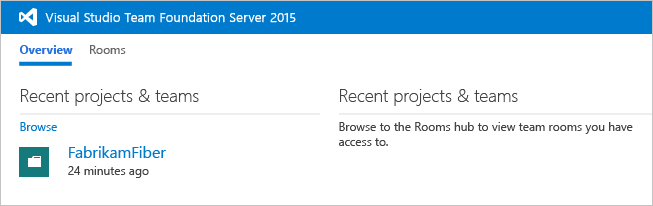
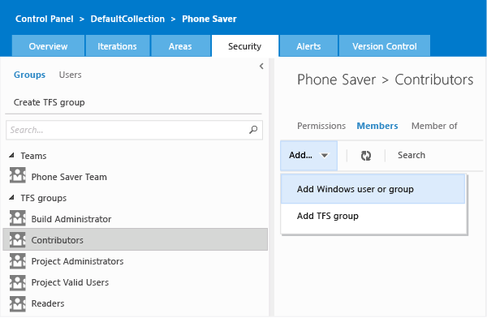

# Add users to a TFS team project and sharepoint 

**TFS 2015** | **TFS 2013**

As roles and responsibilities change,
you might need to change the membership or permission levels for individual members of a team project.
This is particularly true if your project depends on resources
that use SQL Server Reporting Services or SharePoint Products
because permissions for those resources are managed separately.

If all you want to do is add a user to an existing team in TFS,
and you don't have to worry about specific permissions for other resources,
skip this topic and [simply add them to a team](../work/scale/multiple-teams.md).

To view permissions for yourself or another user, see [View permissions](../security/view-permissions.md).  

## Add users to a team project

1.  Open the web portal and navigate to the project where you want to add users or groups.

    

    > [!TIP]  
    > Managing users is much easier [using groups](../security/about-permissions.md), not individual users.

    Choose the gear icon  to open the administration context for the project,
	and then navigate to the Security tab.

2.  In **Groups**, choose one of the following:

    -   To add users who will require minimal access to the project, choose **Readers**.

    -   To add users who will contribute fully to this project, choose **Contributors**.
	By default, the team group created when you created the project is included as a member of the Contributors group, 
	so you could choose to add the new user as a member of the team instead, and the user would automatically inherit Contributor permissions. 
	For more information, see [Add team members to a team](../work/scale/multiple-teams.md).

    -   To add users who will act as project leads, choose **Project Administrators**.

    After you have chosen one of those groups, add a user or a user group.

    

3.  In **Identities**, specify the name of the user or group you want to add.

   	> The first time you add a user or group to Team Foundation Server,
	> you can't browse to it or check the friendly name.
	> After the identity has been added once in Team Foundation Server, you can just type the friendly name.

4.  Depending on the user, you might want to customize their permissions for other functionality in the project,
such as [areas and iterations](../work/customize/set-area-paths.md)
or [shared queries](../work/customize/set-area-paths.md).
You can also control access to projects, version control, build, and work items;
learn how in [Restrict access in TFS](restrict-access-tfs.md).

## Add users to Sharepoint

If your TFS deployment is integrated with SharePoint Foundation,
you'll need to manage membership in the SharePoint groups to grant permissions to the team project portal
for your TFS users.

See [Set SharePoint site permissions](../security/set-sharepoint-permissions.md) or [Grant permissions to view or create SQL Server reports in TFS](../report/admin/grant-permissions-to-reports.md). 

## Verify

1.  Open the web portal in administration mode and choose **Control Panel**
to navigate to the top-level administration context.

2.  Choose the **Access levels** tab.

3.  Choose the name of each license group in turn, and review the following information:

    -   Which licensing group is set as the default group for the deployment.
	That group name will be followed by **(Default)**.
	This is the group that all users of your deployment of Team Foundation Server will be assigned to by default.

    -   Whether the user for whom you are determining licensing levels is a member
	of a different licensing group than the default group.
	If so, review the description of the features of that licensing group to better understand
	what features are and are not available to that user.

4.  To review the licensing group membership of all users in the deployment at once, choose **Export Audit Log**.
The membership information will be exported to a comma-delimited file.
Save or open the file.

To add an administrator you need to add that user to groups
at the [project-collection level](add-administrator-project-collection.md)
or at the [server-level for TFS](../tfs-server/add-administrator-tfs.md).

To restrict access to a team project or to functional areas within a team project, 
see [Restrict access in TFS](restrict-access-tfs.md).
