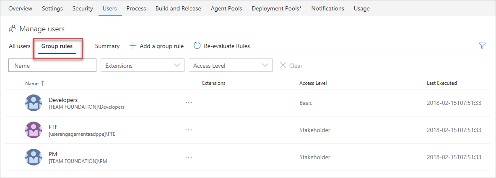
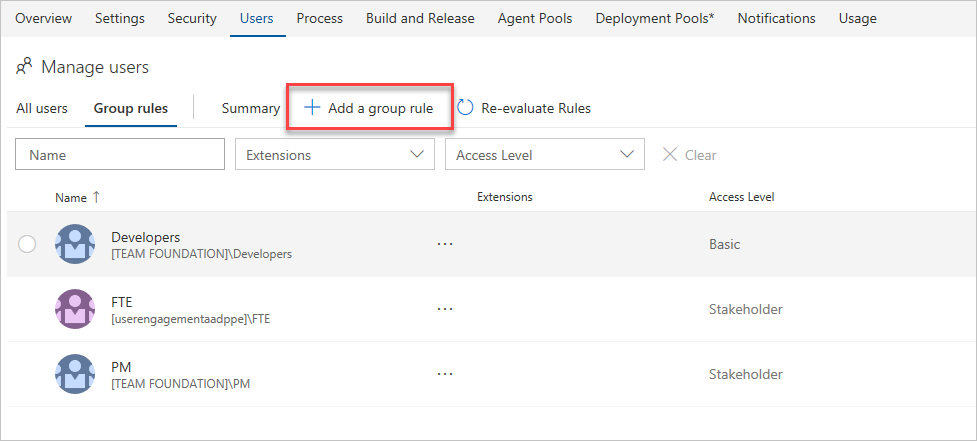
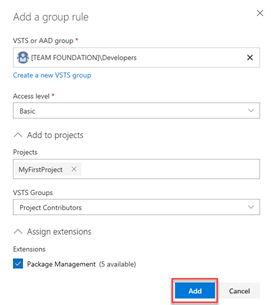

# Add a group rule to assign access levels and extensions to users

**VSTS**

VSTS includes group-based licensing for Azure AD groups and VSTS groups.
You can assign an access level or extensions to a group, and VSTS will ensure that those resources are assigned to all members of the group.

When users leave the group, those licenses are freed up and returned to your pool.
This eliminates the need for automating license management on your own to reflect changes in your organizational structure on a per-user basis.

## Prerequisites

To manage licenses and group rules, you must be a Project Collection Administrator (PCA) for the VSTS account. If you're not a member of the Project Collection Administrators Group, [get added as one](../security/set-project-collection-level-permissions.md).

## Assign required licenses

1. Sign in to your VSTS account and go to the **Users** page in your account settings.
2. Go to the **Security** page and check the membership of the Project Collection Administrators group.
3. Choose the **Group rules** tab. This view shows you all your created group rules.

   

4. Choose **Add a group rule** and complete the resulting dialog for the group that you would like to create a rule for, including an access level for that group and any optional project access or extensions that you would like the group to have.

    

5. To complete the assignment, choose **Add** at the bottom of the dialog.

    

A notification is displayed that shows the status and outcome of the rule. If the assignment couldn't be completed (for example, because your VSTS account didn't have enough licenses purchased), choose **View status** to view details.

## Resolve assignment errors

As users sign in to your VSTS account, they will be assigned access levels and extensions based on their group memberships. If there are not enough licenses or extensions to assign the specified resources to the user, based on their group memberships, VSTS will notify all Project Collection Administrators via email that further resources need to be purchased. To find users in an error state, the Project Collection Administrator can do the following.

1. Go to the **Users** page in account settings. There will be a notification indicating that there are users missing extensions or basic access levels.
2. To see how many of each resource is missing, choose **Fix assignment errors**.
3. Complete purchases for any missing resources, and then choose **Fix errors** to have them automatically assigned to the specified users.
