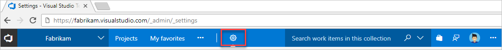

#  Change account owner for VSTS

**VSTS**

When your team's roles and responsibilities change, 
you can change your VSTS account owner to another user. 

<a name="ChangeOwner"></a>
## Before you start

You must have at least Basic access, not Stakeholder, and VSTS 
[project collection administrator or account owner permissions](faq-change-account-ownership.md#find-owner-pca). 
If no one has these permissions, contact 
[VSTS Support](https://www.visualstudio.com/team-services/support).

Make sure that the new owner: 

*	Has been added and invited to your VSTS account 
(```https://{youraccount}.visualstudio.com```).  
*	Also has at least Basic access, not Stakeholder. 
Learn [how to manage users and access](add-account-users-assign-access-levels.md).  
*	Has signed in to your VSTS account, 
created a Visual Studio profile, 
and agreed to the Terms of Service. 

##	Change VSTS account owner

0.	Sign in to your VSTS account 
(```https://{youraccount}.visualstudio.com```). 

	[Why am I asked to choose between my work or school account and my personal account?](faq-change-account-ownership.md#ChooseOrgAcctMSAcct)

0.	To find the current account owner, 
go to your VSTS account settings

	

0.	Under **Settings**, find the current owner.

	

0.	Change the account owner.

	

0.	Find and select the new owner.

	

	[Can't find the person you want?](faq-change-account-ownership.md#NoNewOwner) 

0.	Save your changes.

	

	Your VSTS account has a new owner! 

