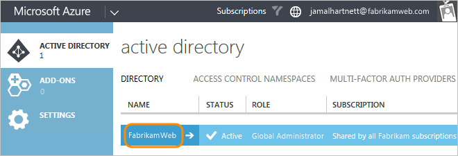

#	Change Azure AD tenant -- prepare target directory

**VSTS**

Now you'll set up target directory permissions for your Microsoft account 
to continue performing the migration. You'll also add your VSTS 
account users to the target directory, if they're not members already, 
so they can get VSTS account access as directory members.

## Set up your Microsoft account as Azure subscription Co-administrator

[See steps here](/azure/billing/billing-add-change-azure-subscription-administrator).

[Why am I asked to choose between my work or school account and my personal account?](faq-azure-access.md#ChooseOrgAcctMSAcct)

## Set up your Microsoft account as a user administrator in the target directory

0.	Find and select the directory that you want connected to your VSTS account.

	

0.	[Add your account to the directory](https://docs.microsoft.com/en-us/azure/active-directory/active-directory-create-users), and in the **Tell us about this user** step, choose **User with an existing Microsoft account**.  In the **user profile** step, choose the user administrator role.

> [!div class="nextstepaction"]
> [Change Azure AD tenant: disconnect from source directory](change-azure-ad-vsts-account-disconnect.md)

