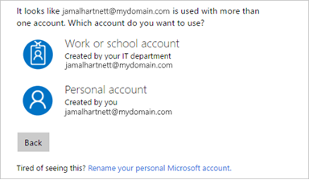
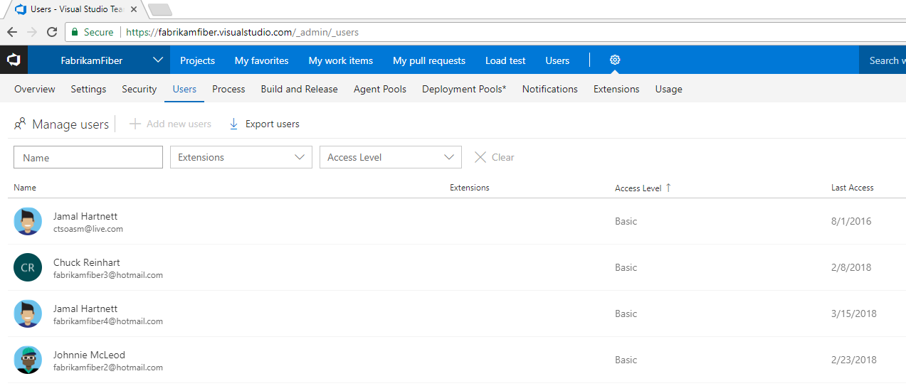
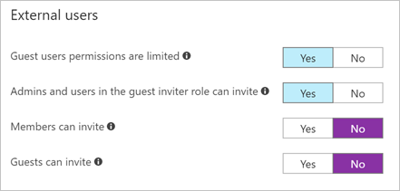
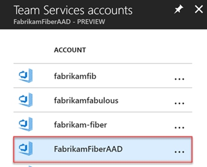
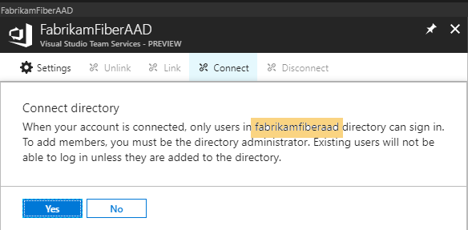

# Connect VSTS account to Azure Active Directory (Azure AD)

**VSTS**

Azure AD users - you can connect your existing Azure AD tenant to VSTS, even if you started with a Microsoft account for your VSTS instance.

If your VSTS account was created with a Microsoft account,
you can connect your VSTS account to your
organization's directory (tenant) in
[Azure Active Directory (Azure AD)](https://azure.microsoft.com/en-us/documentation/articles/active-directory-whatis/).
You can then sign in to VSTS with the same username
and password that you use with these Microsoft services.
You can also [enforce conditional access policies](https://docs.microsoft.com/en-us/azure/active-directory/active-directory-conditional-access-azure-portal-get-started) for accessing
your team's critical resources and key assets.

If your users are being asked to choose between signing in to VSTS with their personal or work or school account, you will benefit from connecting your VSTS account to your organization's Azure AD.

[Why am I asked to choose between a "work or school account" and a "personal account"?](faq-azure-access.md#ChooseOrgAcctMSAcct)

>[!div class="mx-imgBorder"]

For more information, see the [conceptual overview](access-with-azure-ad.md) for using Azure AD with VSTS.

## Understand where you're starting from

While the steps to connect your VSTS account to Azure AD are consistent, it’s important to understand where you're starting from before connecting your VSTS account to your target Azure AD tenant.

One of the following scenarios likely applies to your situation:

- I use a Microsoft account, "yourname"@fabrikam.com (for example, jamalhartnett@fabrikam.com), for VSTS and I want to connect to the target Azure AD tenant and replace with jamalhartnett@fabrikam.com.
  - This document is for you!
- I use a Microsoft account, "yourname"@fabrikam.com (for example, jamalhartnett@fabrikam.com), for VSTS and I want to connect to the target Azure AD tenant and replace with jamal.hartnett@fabrikam.com.
    - Work with CSS to help with the migration by [creating a new support ticket](https://support.microsoft.com/en-us/getsupport?tenant=ClassicCommercial&locale=en-us&supportregion=en-us&pesid=15339&oaspworkflow=start_1.0.0.0&ccsid=636538111396376813)
      - Problem Type: Configuring Team Services
      - Category: Configuring with Azure Active Directory
- I use a Microsoft account, jamal@outlook.com, and I want to connect to the target Azure AD tenant and replace with jamal@fabrikam.com.
    - Work with CSS to help with the migration by [creating a new support ticket](https://support.microsoft.com/en-us/getsupport?tenant=ClassicCommercial&locale=en-us&supportregion=en-us&pesid=15339&oaspworkflow=start_1.0.0.0&ccsid=636538111396376813)
      - Problem Type: Configuring Team Services
      - Category: Configuring with Azure Active Directory

## Overview of the connection process

The following steps outline the high-level process of connecting VSTS to Azure AD.

1. Ensure all VSTS users are in the target Azure AD tenant, either as members or Business-to-Business (B2B) guests.
2. Inform your users of the upcoming change.
3. Connect your VSTS account to your organization’s directory.
4. Inform users of the completed change and that they should sign in with their Azure AD credentials from now on.

## Ensure all VSTS users are in the target Azure AD tenant

All users of the VSTS must exist in the target Azure AD tenant. Any user that is not in the tenant will be a "historic" user, unable to log in, however their history is retained.

1. Sign in to your VSTS account and go to the **Users** tab.

    

2. Compare the VSTS list of emails against the list in your target Azure AD tenant.

    a. If any users exist in the VSTS Users hub, but are missing from your target Azure AD tenant, [add them as B2B guests](https://docs.microsoft.com/en-us/azure/active-directory/active-directory-b2b-iw-add-users).

    

    These guests can be
    - external to organization (User@othercompany.com) or
    - existing Microsoft account (MSA) users (user@outlook.com or user@gmail.com).

    b. If you are notified that you do not have permissions to invite users, verify that your user account is authorized to invite external users under User Settings.

    

    - If you have recently modified these settings or assigned the Guest Inviter role to a user, there might be a 15- 60-minute delay before the changes take effect.

    c. If no paid Azure AD license exists in the tenant, every invited user gets the rights that the Azure AD Free edition offers.

    d. If users exist, but their email addresses are different from their Microsoft accounts, work with CSS to help with the migration by [creating a new support ticket](https://support.microsoft.com/en-us/getsupport?tenant=ClassicCommercial&locale=en-us&supportregion=en-us&pesid=15339&oaspworkflow=start_1.0.0.0&ccsid=636538111396376813).

## Inform users of the upcoming change

While there is no downtime, users will be affected by this change, so it's best to let them know before you begin this process. Let them know ahead of time that there will be a short series of steps for each user to complete and that as the organization transitions from Microsoft to Azure AD identities and the emails match, users’ benefits will continue to work with their new Azure AD identity.

## Connect your VSTS account to your organization's directory

1. Determine which user is performing the connection of VSTS to Azure AD.
    - Ensure this user exists in the target Azure AD tenant as a guest or member.
    - Ensure this user is a member of the "[Project Collection Administrators](https://docs.microsoft.com/en-us/vsts/security/set-project-collection-level-permissions?toc=/vsts/accounts/toc.json&bc=/vsts/accounts/breadcrumb/toc.json#add-a-user-or-group-to-a-security-group)" group or an [owner of the VSTS account](https://docs.microsoft.com/en-us/vsts/accounts/faq-change-account-ownership#find-owner-pca).

    - If you can't meet these requirements with your own identity, you should:
        - Create a new Microsoft account (for example FabrikamMigration@outlook.com
        - Add the new identity as a member of the "[Project Collection Administrators](https://docs.microsoft.com/en-us/vsts/security/set-project-collection-level-permissions?toc=/vsts/accounts/toc.json&bc=/vsts/accounts/breadcrumb/toc.json#add-a-user-or-group-to-a-security-group)" group
        - Add the new identity as a B2B guest of the target Azure AD tenant
        - Use this new user to complete the migration

2. [Sign in to the Azure portal](https://portal.azure.com/) with your personal Microsoft account as the VSTS account owner.

   - The target tenant is selected in the upper right corner of the Azure portal.

        

3. Browse to your VSTS account by typing **Team services accounts** into the **Search** box, and choosing **Team Services accounts**.

    

4. Select your account. If you don't see your account, check to make sure you are using the expected tenant in the upper right of the Azure portal and confirm that the user is an owner of the VSTS account in question.

5. Choose **Connect**.

    - If **Connect** is greyed out:
        - You are either already connected to a tenant (disconnect is enabled) or
        - Your VSTS account may not be linked to Azure AD (link would be enabled).

   

6. Choose **Yes** to confirm.

   

7. Your account is now connected to your organization's directory.

8. To confirm that the process has been completed, open a clean browser (in private) and sign in to your VSTS account with your Azure AD/work credentials.
9. If you created a temporary user to complete the migration, change the owner of the VSTS account back to the initial user and delete the temporary Microsoft account, as it is no longer needed.

## Inform users of the completed change

Visual Studio subscription administrators assign subscriptions to a user’s corporate email so that they can get the welcome email and notifications about the subscription.  If the email of the identity and the subscription match, the user will be able to access the benefits of that subscription.  As your organization transitions from Microsoft to Azure AD identities and the emails match, your user’s benefits will continue to work with their new Azure AD identity.

When you inform your users of the completed change, include the following tasks that each user in the VSTS account must complete:

1. If you use the Git command line tool, the tenant cache for the [Git Credential Manager may need to be cleared](https://github.com/Microsoft/Git-Credential-Manager-for-Windows/blob/master/Docs/Faq.md#q-why-is-gitexe-failing-to-authenticate-after-linkingunlinking-your-visual-studio-team-services-account-from-azure-active-directory).

    Deleting the **%LocalAppData%\GitCredentialManager\tenant.cache** file on each client machine will resolve the issue.

2. If you use alternate authentication tokens (PAT, SSH) used by tools or scripts, [regenerate new tokens](https://docs.microsoft.com/en-us/vsts/accounts/use-personal-access-tokens-to-authenticate) for the Azure AD user.

    a. On your VSTS page, in the upper right, choose your profile image and choose **Security**.

    b. On the Personal access tokens page, choose **Add**. Enter a description. Scroll to the bottom of the page and choose **Create token**.

    c. When the token is created, make a note of it as it cannot be viewed again. Copy it from the browser into the clipboard.

3. If you don't want to be prompted to choose between accounts, [rename your Microsoft account](https://support.microsoft.com/en-us/help/11545/microsoft-account-rename-your-personal-account) to a different email that does not conflict with your Azure AD identity or simply [delete your Microsoft account](https://support.microsoft.com/en-us/help/12412/microsoft-account-how-to-close-account) if it’s no longer needed .

4. If you used  a Microsoft   account to sign up for a [Visual Studio with MSDN subscription](https://www.visualstudio.com/vs/pricing/) that includes VSTS as a benefit, you can add a work or school account that's managed by Azure Active Directory to your subscription. Learn [how to link work or school accounts to Visual Studio with MSDN subscriptions](https://docs.microsoft.com/en-us/vsts/billing/link-msdn-subscription-to-organizational-account-vs).

   [More questions about connecting?](faq-azure-access.md#faq-connect)

## FAQ

**Q:** Will my users still retain their existing Visual Studio subscriptions?

**A:** Visual Studio subscription administrators typically assign subscriptions to a user’s corporate email so that they can get the welcome email and notifications about the subscription. If the email of the identity and the subscription match, the user will be able to access the benefits of that subscription. As your organization transitions from Microsoft to Azure AD identities and the emails match, your user’s benefits will continue to work with their new Azure AD identity. If the email that the subscription is assigned to differs from your Azure AD identity’s email, then your subscription administrator will need to [reassign the subscription](https://docs.microsoft.com/en-us/vsts/billing/vs-subscriptions/manage-vs-subscriptions#getting-started), or the user will need to [add an alternate identity to their Visual Studio subscription](https://docs.microsoft.com/en-us/vsts/billing/faq-link-msdn-subscription-org-account#steps-to-add-an-alternate-identity-to-your-visual-studio-subscription).

**Q:** What if my SSH/PAT token is no longer valid?

**A:** Complete the following steps:

   1. On your VSTS page, in the upper right, choose your **profile image** and then choose **Security**.
   2. On the Personal access tokens page, choose **Add**.
   3. Enter a description and go to the bottom of the page and choose **Create token**.
   4. When the token is created, make a note of it as it cannot be viewed again. Copy it from the browser into the clipboard.

**Q:** What if sign-in is required when using the identity picker?

**A:** Clear the browser cache and delete any cookies for the session.

**Q:** What if my work items are indicating that the users aren’t valid.

**A:** Clear the browser cache and delete any cookies for the session.

**Q:** Why can’t I make purchases after connecting to a directory?

**A:** By changing the directory associated with your Azure subscription to the directory your VSTS account uses, you’ll be able to make purchases again. [Learn more](https://docs.microsoft.com/en-us/azure/active-directory/active-directory-how-subscriptions-associated-directory).

**Next:**

- [Manage users and access](add-account-users-assign-access-levels.md)
- [Manage access with Azure AD groups](manage-azure-active-directory-groups-vsts.md)