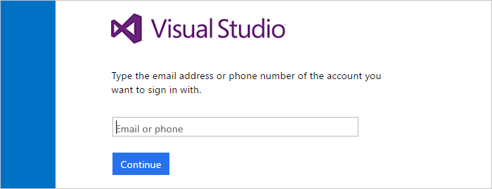
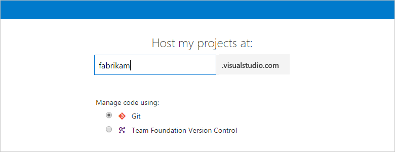
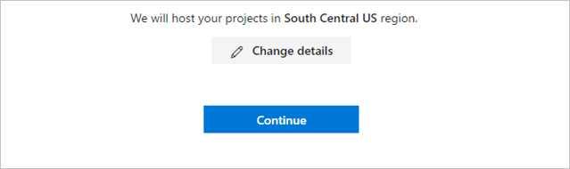
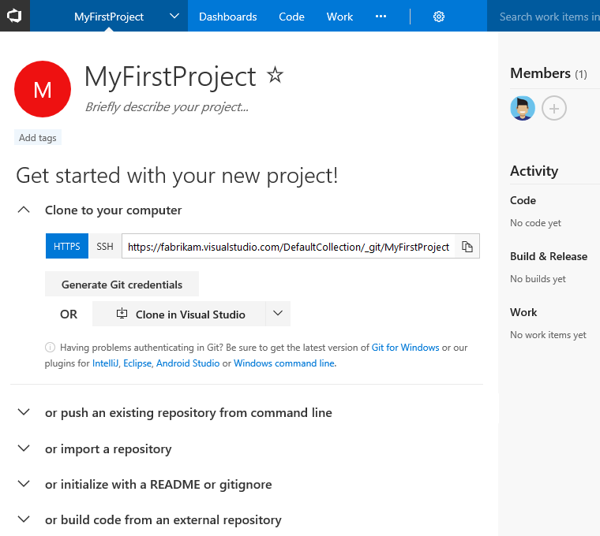

# Create your VSTS account with a personal Microsoft account or a work/school/organization account

**VSTS**

Sign up for a [VSTS](https://www.visualstudio.com/products/visual-studio-team-services-vs) 
account to upload and share code in free unlimited private 
Git repositories or Team Foundation Version Control. 
Then connect your favorite development tool like Eclipse, Xcode, 
Visual Studio, IntelliJ, or Android Studio to work on apps anytime, anywhere. 
VSTS offers integrated, enterprise Agile tools for DevOps, 
so your team can build often, test early, and ship faster.

> Want to set up an on-premises server? 
> [Get Team Foundation Server here](https://www.visualstudio.com/products/tfs-overview-vs), 
> or learn [how to install and set up Team Foundation Server](/tfs/server/install/get-started). 

[What users can join for free?  What do they get in VSTS?](faq-create-account.md#free-users)

<a name="how-sign-up"></a>

##	What do I need to sign up for a VSTS account?

*	To use only Microsoft accounts 
	with your VSTS account, follow the steps below and ignore the Azure Active Directory (Azure AD) call outs. 

	Don't have a Microsoft account?  You can create a Microsoft account 
	when you sign up for VSTS.

	Use your Microsoft account if you don't need to authenticate users 
	for an organization with [Azure AD](https://azure.microsoft.com/en-us/documentation/articles/active-directory-whatis/). 
	All users must sign in with Microsoft accounts to your VSTS account.

*	Alternatively, to authenticate users and control account access through your 
	organization's directory (tenant) in Azure AD, follow the steps below and pay attention to the Azure AD call outs.

	Use your work or school account to **automatically connect** your VSTS account to your organization's directory. 
	All users must be members in that directory to get access to your VSTS account, or you must use 
	[Azure AD business-to-business (B2B) collaboration capabilities](https://docs.microsoft.com/azure/active-directory/active-directory-b2b-what-is-azure-ad-b2b) to 
	add users from other organizations.

	You'll need a work or school account that's managed by your organization's directory. 
	If you use Azure or Office 365, you might have this already.  If you don't, learn how to 
	[sign up for Azure as an organization](https://azure.microsoft.com/en-us/documentation/articles/sign-up-organization/).

	To use existing on-premises identities with VSTS, learn how to 
	[use Azure AD Connect for integrating on-premises directories with Azure AD](https://azure.microsoft.com/en-us/documentation/articles/active-directory-aadconnect/).


## How does Azure AD control access to VSTS?

VSTS authenticates users through your organization's directory 
so that only users who are members in that directory can get access to your VSTS account. 
When you remove users from that directory, 
they can't access your account anymore. Only specific 
[Azure AD administrators](https://azure.microsoft.com/en-us/documentation/articles/active-directory-assign-admin-roles/) 
can manage users in your directory, so administrators control who can get access to your VSTS account.

Without Azure AD, you're solely responsible for controlling 
VSTS account access. And all users must sign in with Microsoft accounts. 
[What are other differences?](faq-create-account.md#SignInAccountDifferences)


<a name="SignIn"></a>
## Create your account and sign up for VSTS

0.	Go to [VSTS](https://go.microsoft.com/fwlink/?LinkId=307137).  Enter the email address for your Microsoft account, or for Azure AD use your work or school account.

	**Microsoft account**: If you're a Visual Studio subscriber and get VSTS as a benefit, use the Microsoft account associated with your subscription. 

	**Azure AD**: Your sign-in page might look different, based on the work or school account that you used.

	

	Got [browser problems?](faq-create-account.md#browser-problems)

0.	Enter your email address for your Microsoft account. Then enter your password to finish signing in.  If you are not 
using **Azure AD**, and you don't have a Microsoft account, you can create a Microsoft account at this time.

	
	
	**Azure AD**: Enter your password for your work or school account.
	
	

	[Why am I asked to choose between my work or school account and my personal account?](faq-create-account.md#ChooseOrgAcctMSAcct)

0.	Name your VSTS account. To manage your code, choose Git or Team Foundation Version Control.

	

	Learn which version control ([Git](../git/overview.md) or [Team Foundation Version Control](../tfvc/overview.md)) 
	works best for you.

0.	Confirm your account's location, and if you're using **Azure AD**, confirm the **directory** 
that you're connecting to your VSTS account. 

	
	
	**Azure AD**:
	
	

	**Microsoft account and Azure AD**: VSTS creates your first team project as "MyFirstProject" 
	and uses Agile as your default work item process to organize your work. 
	Choose **Change details** to 
	[rename your team project, change the account location, or select another process, like Scrum](faq-create-account.md#account-location).
	
	**Azure AD**: After you create your account, only members of
	the directory shown here can get access to your VSTS account, or you must use 
	[Azure AD business-to-business (B2B) collaboration capabilities](https://docs.microsoft.com/azure/active-directory/active-directory-b2b-what-is-azure-ad-b2b) to 
	add users from other organizations.  If you belong to multiple directories, check that you want
	to connect this directory to your VSTS account.  Changing the directory now is easier than [changing the
	directory later](faq-create-account.md#ChangeDirectory).

0.	After VSTS creates your account and team project, 
add code, work items, or more users. 

	

	Congratulations, you're now a VSTS account owner! 

	To sign in to your VSTS account at any time, go to ```https://{youraccount}.visualstudio.com```.

	> [!NOTE]
	> If you activated your Visual Studio subscription with a Microsoft account, and your subscription includes VSTS
	> as a benefit, learn [how to add your work or school account](../billing/link-msdn-subscription-to-organizational-account-vs.md) to your
	> subscription so you can use your subscriber benefits in VSTS.

## Try this next
> [!div class="nextstepaction"]
> [Manage users and access](add-account-users-assign-access-levels.md)

*	Add code to Git or Team Foundation version control

	*	Git with [Eclipse](/vsts/java/download-eclipse-plug-in), 
	[Xcode](../git/share-your-code-in-git-xcode.md), 
	[Android Studio](/vsts/java/download-android-studio-plug-in), 
	[IntelliJ](/vsts/java/download-intellij-plug-in), 
	[Visual Studio](../git/share-your-code-in-git-vs-2017.md), or 
	[Visual Studio Code](https://code.visualstudio.com/docs/editor/versioncontrol)

	*	TFVC using [Eclipse](/vsts/java/download-eclipse-plug-in), 
	[Xcode](../tfvc/share-your-code-in-tfvc-xcode.md), 
	[Visual Studio](../tfvc/use-visual-studio-git.md), or 
	[Visual Studio Code](https://code.visualstudio.com/docs/editor/versioncontrol)

*	[Create your backlog](../work/backlogs/create-your-backlog.md), 
	[manage your process](../work/customize/process/manage-process.md), 
	or [customize your process](../work/customize/process/customize-process.md)


