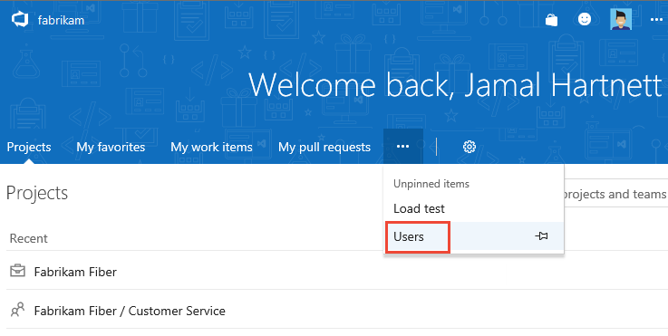
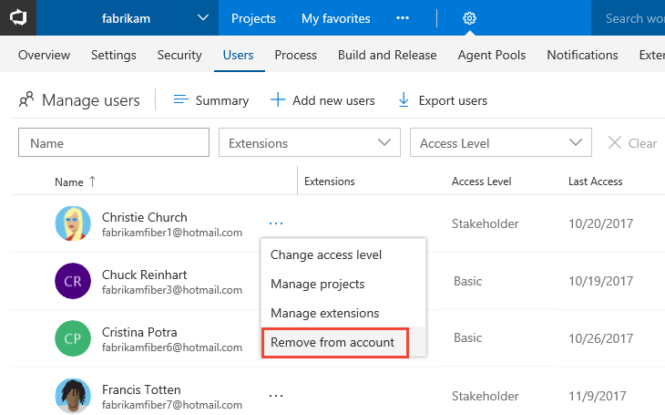
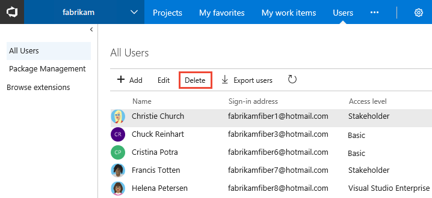

# Delete users for Visual Studio Team Services (VSTS)

**VSTS**

If a user no longer requires access to a team project or your VSTS account, you can remove their access to a team project or your account. 

### Prerequisites

- You'll need [VSTS project collection administrator or account owner permissions](../security/set-project-collection-level-permissions.md?toc=/vsts/accounts/toc.json&bc=/vsts/accounts/breadcrumb/toc.json). 


##  Remove users from your VSTS account

0. Sign in to your VSTS account (```https://{youraccount}.visualstudio.com```).

	[Why am I asked to choose between my "work or school account" and my "personal account"?](faq-add-delete-users.md#ChooseOrgAcctMSAcct)

0. Go to the **Users** hub.  

	 

0. If you have Streamlined User Management enabled, open the context menu**...** for the user to remove and select **Remove from account**. 

	

	Or, from the table of users, select the user account and choose  **Delete**.  

	

0. Choose **Remove** in the confirmation dialog.

0. To make sure that you've removed the user completely, make sure they are not in any of your [security groups](../security/add-users-team-project.md). 

	[Why don't users appear or disappear promptly in VSTS after I add or delete them in the Users hub?](faq-add-delete-users.md#users-delay)

0. If you deleted paid users who had Basic features, and you don't want to pay for these users, you must also 
[reduce these users in the Visual Studio Marketplace](../billing/buy-basic-access-add-users.md), 
so you're not charged in your next Azure billing cycle.

 > To reduce or cancel these users for the next month, you must make updates before the last day of the current month. 
 > Your bill won't show these changes until the next month because paid users are monthly purchases. 

##  Remove users from a team or team project

To remove users from a team project, remove them from the Teams groups they belong to or the Contributors group for the team project. See [Add users to a team project or specific team](../security/add-users-team-project.md). From the Members page of a team group or security group, you can Remove a user. 

 

## Related notes

 [Add administrators, set permissions at the project-level or project collection-level](../security/set-project-collection-level-permissions.md). 
- [Change individual permissions, grant select access to specific functions](../security/change-individual-permissions.md)
- [Grant or restrict access to select features and functions](../security/restrict-access.md)
- [Troubleshoot adding and deleting account users in the VSTS user hub](faq-add-delete-users.md)
- [Troubleshoot adding members to team projects in Visual Studio Team Services (VSTS)](faq-add-team-members.md)