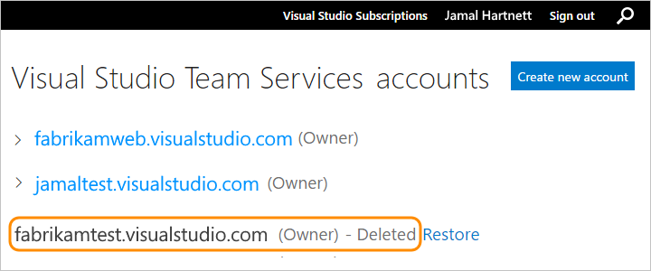

# Delete your VSTS account

**VSTS**

If you don't need your  VSTS account, you can delete it. 
If you change your mind within 90 days, 
you can [recover your account](recover-your-vsts-account.md). 
After 90 days, your account 
and data are permanently deleted.

When you delete your VSTS account:

*   All users lose access to account services and resources immediately.

*   Your account URL becomes available for anyone to use. 
But it might take up to 1 hour before your account URL becomes available again. 

*   Your account is disabled and appears deleted in your profile for 90 days.

*   If your account is linked to an Azure subscription for billing purchases, 
you must unlink your account before you delete your account. 

	You're still charged for any paid users and
	VSTS that your account uses during this billing cycle. 
	Billing will stop after the current cycle ends.

To delete your VSTS account, 
you'll need VSTS account owner permissions. 
[How do I find the account owner?](faq-delete-restore-vsts-account.md#find-owner)

##  Before you delete your VSTS account

If your VSTS account uses an Azure subscription to bill purchases, 
you must first unlink your account from your Azure subscription before deleting your account. 

To unlink your account, 
you'll need VSTS account owner permissions 
and at least Azure subscription Co-Administrator permissions. 
[How do I find the account owner?](faq-delete-restore-vsts-account.md#find-owner) Or learn more about 
[Azure subscription administrators](https://azure.microsoft.com/en-us/documentation/articles/billing-add-change-azure-subscription-administrator/).

0.  Sign in to the [Azure classic portal](https://manage.windowsazure.com/) 
or [Azure portal](https://portal.azure.com). 

0.  Unlink your account from your Azure subscription.

	**Azure classic portal**

	

	**Azure portal**

	

	

	[Need help?](faq-delete-restore-vsts-account.md#get-support)

##  Delete your VSTS account

You'll need at least Basic access and VSTS account owner 
permissions to delete your VSTS account. 
[How do I find the account owner?](faq-delete-restore-vsts-account.md#find-owner)

0.  Sign in to your VSTS account (```https://{youraccount}.visualstudio.com```).

0.  Go to your VSTS account settings.

	

0.  Under **Settings**, delete your account.

	

	You'll be redirected to www.visualstudio.com, but you'll stay signed in. 

0.	To review your accounts, go to your 
[Visual Studio profile](https://app.vsaex.visualstudio.com/profile/view) 
where you'll see your deleted account. 
    
	

	[Need help?](faq-delete-restore-vsts-account.md#get-support)

<a name="undelete"></a>
##  Restore your VSTS account

Your account will be disabled but available for 90 days after you delete it. 
If you change your mind during this time, you can recover your account. 
After 90 days, your account and data are permanently deleted.

You'll need VSTS account owner 
permissions to restore your VSTS account. 
[How do I find the account owner?](faq-delete-restore-vsts-account.md#find-owner)

0.	Sign in to your [Visual Studio profile](https://app.vsaex.visualstudio.com/profile/view).

	[Why am I asked to choose between my work or school account and my personal account?](faq-delete-restore-vsts-account.md#ChooseOrgAcctMSAcct)

0.  Restore your account.

	

	*	If your account URL is still available, you can restore it.

		

	*	If your account URL isn't available, provide a new URL.

       

0.  After you restore your account:

	*	If billing was set up for your account, you'll have to set it up again. Just 
[relink your account](../billing/set-up-billing-for-your-account-vs.md) to an Azure subscription.

	*   If your account was connected to Azure AD for authenticating user access, you won't have to reconnect it again.

	[Need help?](faq-delete-restore-vsts-account.md#get-support)


