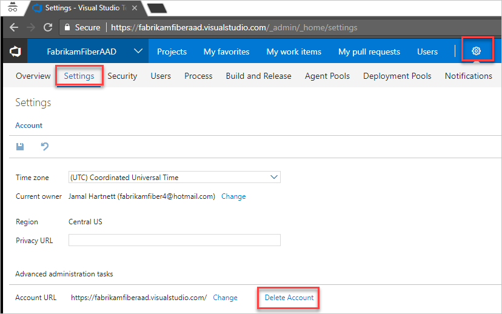
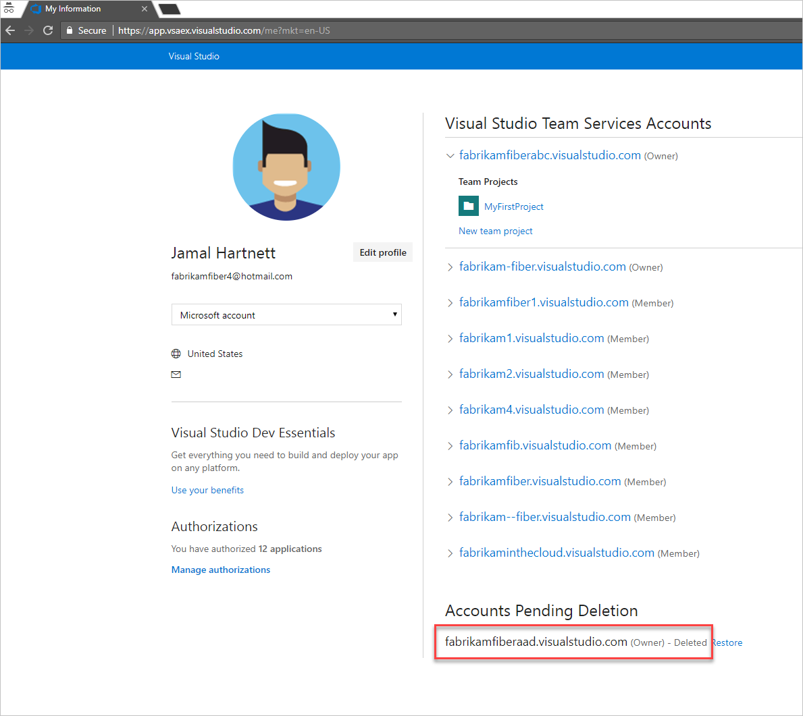

# Delete your VSTS account

**VSTS**

If you don't need your  VSTS account, you can delete it.
If you change your mind within 30 days,
you can [recover your account](recover-your-vsts-account.md).
After 30 days, your account and data are permanently deleted.

When you delete your VSTS account:

* All users lose access to account services and resources immediately.

* Your account URL becomes available for anyone to use. But it might take up to 1 hour before your account URL becomes available again.

* Your account is disabled and appears deleted in your profile for 30 days.

* If your account is linked to an Azure subscription for billing purchases, you must unlink your account before you delete your account.

  You're still charged for any paid users and
  VSTS that your account uses during this billing cycle.
  Billing will stop after the current cycle ends.

To delete your VSTS account, you'll need VSTS account owner permissions. [How do I find the account owner?](faq-delete-restore-vsts-account.md#find-owner)

## Before you delete your VSTS account

If your VSTS account uses an Azure subscription to bill purchases, you must first unlink your account from your Azure subscription before deleting your account.

To unlink your account, you'll need VSTS account owner permissions and at least Azure subscription Co-Administrator permissions. [How do I find the account owner?](faq-delete-restore-vsts-account.md#find-owner) Or learn more about [Azure subscription administrators](https://azure.microsoft.com/en-us/documentation/articles/billing-add-change-azure-subscription-administrator/).

1. Sign in to the [Azure portal](https://portal.azure.com).

2. Enter *team services accounts* in the search box and then choose **Team Services accounts** in the resulting menu.
3. Choose the account you will be deleting.
4. Choose **Unlink**.
  Your VSTS account is unlinked from your Azure subscription.

  **Azure portal**

  

  [Need help?](faq-delete-restore-vsts-account.md#get-support)

## Delete your account

You'll need at least Basic access and VSTS account owner
permissions to delete your VSTS account.
[How do I find the account owner?](faq-delete-restore-vsts-account.md#find-owner)

1. Sign in to your VSTS account (```https://{youraccount}.visualstudio.com```).

2. Go to your VSTS account settings and choose **Delete Account**.



3. To review your accounts, go to your [Visual Studio profile](https://app.vsaex.visualstudio.com/profile/view) where you'll see your deleted account.

  

  [Need help?](faq-delete-restore-vsts-account.md#get-support)
