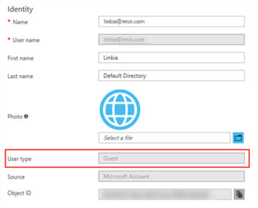

# Troubleshoot adding members to team projects in Visual Studio Team Services (VSTS)

**VSTS**

### Q:	Why can't I add any more members to my team project?

A:	Your VSTS account is free for the first 5 users with Basic access. 
You can add unlimited Stakeholders and Visual Studio subscribers for no extra charge. 
After you assign all 5 free users with Basic access, 
you can continue adding Stakeholders and Visual Studio subscribers. 
To add a 6th user or more with Basic access, 
you'll need to [set up billing in Azure](../billing/set-up-billing-for-your-account-vs.md). 
You can then [pay for more users who need Basic access](../billing/buy-basic-access-add-users.md), 
return to your VSTS account, 
[add these users, and assign them Basic access](add-account-users-assign-access-levels.md). 
This lets you pay monthly for their access, and you can cancel anytime.

If you need more Visual Studio subscriptions, 
learn [how to buy these subscriptions](../billing/vs-subscriptions/buy-vs-subscriptions.md) 
from the [Visual Studio Marketplace](https://marketplace.visualstudio.com/subscriptions).

### Q:	Why can't some users sign in?

A:	This might happen because users must 
sign in with Microsoft accounts 
unless your VSTS account 
controls access with Azure Active Directory (Azure AD). 
If your account is connected to Azure AD, 
users must be directory members to get access. 
[How do I find out if my account uses Azure Active Directory (Azure AD)?](#ConnectedDirectory) 

If you're an Azure AD administrator, 
you can add users to the directory. If you're not, 
work with the directory administrator to add them. 
Learn [how to control account access with Azure AD](access-with-azure-ad.md).

[!INCLUDE [no-access-existing-features](../_shared/qa-no-access-existing-features.md)]

### Q:	 Why did some users lose access to certain features?

A:	This might happen for [different reasons](faq-add-delete-users.md#stopped-features).  

[!INCLUDE [does-account-use-azuread](../_shared/qa-does-account-use-azuread.md)]

### Q:	How do I remove users from my VSTS account?

A:	Learn [how to delete users](delete-account-users.md) 
across all team projects in your VSTS account. 
If you paid for more users, but don't need their account access
anymore, you must reduce your paid users to avoid charges.

### Q: Why can't I find members from my connected Azure AD, even though I am the Azure AD global admin?

A: You are probably a guest in the Azure AD that backs VSTS. By default, Azure AD guests cannot search into the Azure AD and that's why you are not finding users in your Azure AD to add to your VSTS account.

First, check to see if you are an Azure AD guest:

1. Go to the **Settings** section of your VSTS account and look at the **Azure Active Directory** section at the bottom. Make a note of the tenant that backs your VSTS account.
2. Sign in to the new Azure portal (portal.azure.com) and check your user profile in the tenant from step 1. Check the **User type** value as seen below.

   > [!div class="mx-imgBorder"] 

If you are an Azure AD guest, do one of the following:

* Have another VSTS admin - someone who is not an Azure AD guest - manage the users in VSTS for you. Members of the Project Collection Administrators group inside VSTS can administer users.
* Have the AAD admin(s) remove you from the AAD and re-add you, making you an AAD member rather than a guest when they do. See "Can Azure AD B2B users be added as members instead of guests?"
* Change the User Type of the Azure AD guest using Azure AD PowerShell. This is an advanced topic and is not advised, but it does work and allows the user to query Azure AD from VSTS thereafter. 
1. [Download and install Azure AD PowerShell module](https://docs.microsoft.com/en-us/powershell/module/azuread/?view=azureadps-2.0).
2. Open PowerShell and run the following cmdlets.

    a. Connect to Azure AD

        C:\Users\rajr> Connect-AzureAD

    b. Find the objectId of the user
    
        C:\Users\rajr> Get-AzureADUser

    c. Check the usertype attribute for this user to see if they are a guest or member.
    
        C:\Users\rajr> Get-AzureADUser -objectId cd7d47bf-1c6e-4839-b765-13edcd164e66

    d. Change the usertype from *member* to *guest*

        C:\Users\rajr> Set-AzureADUser -objectId cd7d47bf-1c6e-4839-b765-13edcd164e66 -UserType Member

[!INCLUDE [user-delay](../_shared/qa-user-delay.md)]

[!INCLUDE [choose-msa-azuread-account](../_shared/qa-choose-msa-azuread-account.md)]

[!INCLUDE [choose-msa-azuread-account2](../_shared/qa-choose-msa-azuread-account2.md)]

[!INCLUDE [why-cant-sign-in-msa-azuread-account](../_shared/qa-why-cant-sign-in-msa-azuread-account.md)]

[!INCLUDE [find-project-collection-administrator](../_shared/qa-find-project-collection-administrator.md)]

[!INCLUDE [find-account-owner](../_shared/qa-find-account-owner.md)]

[!INCLUDE [get-team-services-support](../_shared/qa-get-vsts-support.md)]
