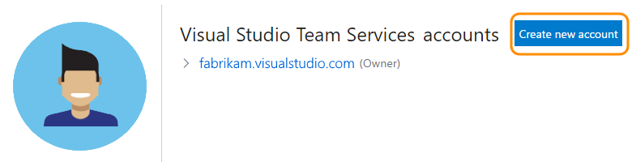

#	Troubleshoot creating a VSTS account

**VSTS**

#### Q: What users can join for free?  What do they get in VSTS?

A: VSTS is free for these users to join:

* 5 users who get [Basic features](https://www.visualstudio.com/team-services/compare-features/) 
like version control, tools for Agile, Java, build, release management, and more. 

* Unlimited users who get [Stakeholder features](https://www.visualstudio.com/team-services/compare-features/) 
like working with your backlog, work items, and queries.

* Unlimited [Visual Studio subscribers](https://www.visualstudio.com/team-services/compare-features/) 
who also get Basic features, and in some cases, additional features with specific extensions, like 
[Test Manager](https://marketplace.visualstudio.com/items?itemName=ms.vss-testmanager-web).

 Learn what else you get with [VSTS](https://www.visualstudio.com/team-services/pricing/).

[!INCLUDE [browser-problems](../_shared/qa-browser-problems.md)]

####Q:  Which Visual Studio subscriptions can I use with VSTS?

A:	Go here to find 
[Visual Studio subscriptions that include VSTS](faq-add-delete-users.md#EligibleMSDNSubscriptions).

####Q:	Why am I asked to provide profile details?

A:	If you're a new user, you can change your profile details. 
You only have to do this step once. 

0.	Confirm your profile details. 

	

0.	Continue creating your VSTS account.

	

[!INCLUDE [account-location-process-template](../_shared/qa-account-location-process-template.md)]

####Q:	Why are some features not available with my account?

A:	Some features require that you install an extension, 
which may be available for free or paid. 

For example, [web-based test case management](https://marketplace.visualstudio.com/items?itemName=ms.vss-testmanager-web)
requires that you install the Test Manager extension, 
but you can [try paid extensions for free](../billing/try-additional-features-vs.md), 
if you haven't started the extension trials already. 
Otherwise, you can [pay for user access](/vsts/marketplace/install-vsts-extension) 
to these features.

####Q:	How many VSTS accounts can I create?

A:	You can [create multiple VSTS accounts](#create-another-account). 
But rather than create another account, you might consider 
[creating another team project](#another-team-project). 
Your account can have unlimited private team projects using Git or TFVC. 

There's no limit on how many VSTS accounts where you can be a member.  

####Q:	How do I create another VSTS account?

A:	Just sign in to your [Visual Studio profile](https://app.vsaex.visualstudio.com/profile/view).

[!INCLUDE [another-team-project](../_shared/qa-another-team-project.md)]

[!INCLUDE [delete-team-project](../_shared/qa-delete-team-project.md)]

[!INCLUDE [find-account-name](../_shared/qa-find-account-name.md)]

[!INCLUDE [recover-password](../_shared/qa-recover-password.md)]

[!INCLUDE [change-account-name-owner](../_shared/qa-change-account-name-owner.md)]

[!INCLUDE [delete-account](../_shared/qa-delete-account.md)]

### Q:	What's the difference between using a Microsoft account and a work account or school account to sign up?

A:	Your choice affects how you control access and 
authenticate users for your VSTS account.

When you sign up with a Microsoft account:

*	You're solely responsible for managing access 
to your VSTS account.
*	All users must sign in with Microsoft accounts.

When you sign up with a work or school account:

*	Your VSTS account is 
automatically connected to your directory in Azure AD.
*	All users must members in the connected directory 
to get access to your VSTS account.
*	The directory administrator has control over who can join the directory.
*	You sign in with work or school accounts, 
or with Microsoft accounts if your company allows that.

To [add users to the directory](https://docs.microsoft.com/azure/active-directory/active-directory-create-users), 
you must be a directory administrator. If you don't have access, 
work with your directory administrator to add users.
Learn more about 
[work or school accounts for your organization](https://docs.microsoft.com/azure/active-directory/sign-up-organization).

### Q:	Can I change the directory after signup?

A:	Yes, see [Change your account's Azure AD](change-azure-active-directory-vsts-account.md).

[!INCLUDE [choose-msa-azuread-account](../_shared/qa-choose-msa-azuread-account.md)]

*	Choose **Work or school account** if you want to use your organization's directory 
to authenticate VSTS users and to control VSTS account access.  This limits access to members in your 
organization's directory. 
All other users must sign in with work or school accounts too. 

*	Choose **Personal account** if you want to use your Microsoft account with VSTS. 
All other users must sign in with Microsoft accounts too.

[!INCLUDE [why-cant-sign-in-msa-azuread-account](../_shared/qa-why-cant-sign-in-msa-azuread-account.md)]

[!INCLUDE [secure-protect-data](../_shared/qa-secure-protect-data.md)]

[!INCLUDE [team-services-sla](../_shared/qa-vsts-sla.md)]

[!INCLUDE [visual-studio-subscription-support](../_shared/qa-visual-studio-subscription-support.md)]

[!INCLUDE [get-team-services-support](../_shared/qa-get-vsts-support.md)]
