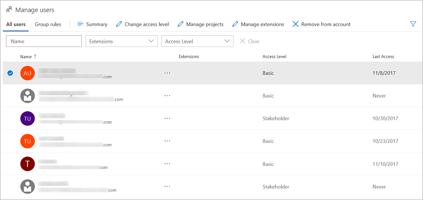

#	Manage users in user hub table view for VSTS

**VSTS**

Add users to your VSTS account and specify the level of features they can use, such as Basic or Stakeholder.  
These kinds of users can join your VSTS account for free:

*	5 users who get [Basic features](https://www.visualstudio.com/team-services/compare-features/), 
such as version control, tools for Agile, Java, build, release management, and more
*	Unlimited users who get [Stakeholder features](https://www.visualstudio.com/team-services/compare-features/), 
such as working with your backlog, work items, and queries
*	Unlimited [Visual Studio subscribers](https://www.visualstudio.com/team-services/compare-features/) 
who also get Basic features, and in some cases, additional features with specific extensions, such as 
[Test Manager](https://marketplace.visualstudio.com/items?itemName=ms.vss-testmanager-web) 

[Need more users with Basic features or Visual Studio subscriptions?](../billing/buy-basic-access-add-users.md)

> You can add people to team projects, 
> rather than to your account. VSTS automatically assigns them 
> [Basic features](https://www.visualstudio.com/team-services/compare-features/), 
> if your account has seats available, 
> or [Stakeholder features](https://www.visualstudio.com/team-services/compare-features/), 
> if not. Learn [how to add members to team projects](add-team-members-vs.md).
>
> When people don't need access to your VSTS account anymore, [delete them](delete-account-users.md) from your account. 

## How does *access* differ from *permissions*?

Access levels control which features are available to users, while permissions control their access to account resources. 
[Can't access some features?](faq-add-delete-users.md#feature-access) 
For TFS, learn [how to change access levels](../security/change-access-levels.md) 
or [buy more access to TFS or the Test hub](../billing/buy-access-tfs-test-hub.md). 

To control access to account resources instead, learn [how to add permissions](../security/add-users-team-project.md) or 
[restrict permissions](restrict-access-tfs.md).  To change how many users can access paid extensions in your 
VSTS account, 
learn [how to change paid extension users](../billing/change-number-paid-extension-users.md).

## Required Permissions

You'll need [VSTS project collection administrator or account owner permissions](faq-add-delete-users.md#find-owner). 

##	Manage users in table view

The Users view shows key information per user in a table. You can see and modify assigned service extensions and 
access levels.  You can multi-select users and bulk edit their extensions and access.  You can filter by searching for 
partial user names, access level, or extension names.  You can see the last access date for each user to help you choose 
from whom you might remove access or lower access to stay within your license limits.

Go to the User Hub:

Choose a user or group of users in the table and then choose the **...** in the name column to see the context 
menu.  The menu supports **Change access levels**, **Manage projects**, **Manage extensions** (if there are extensions), 
and **Remove from account** (deletes user).

