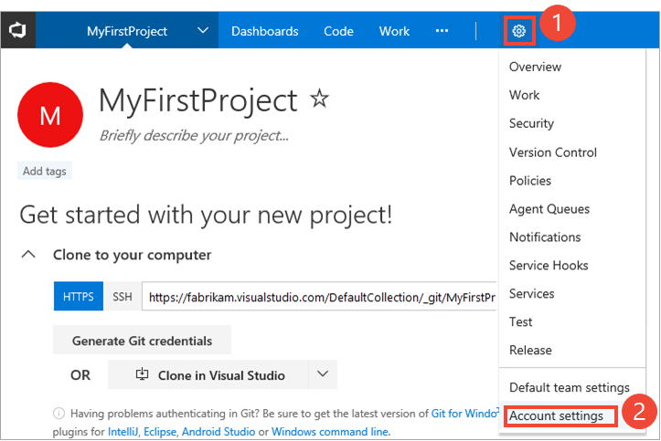
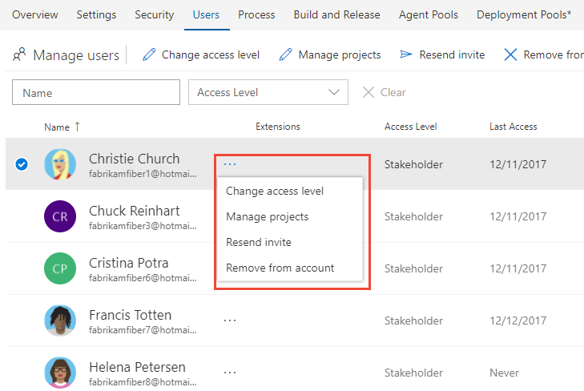

# Manage users for VSTS

**VSTS**

Add users to your VSTS account and specify the level of features they can use, such as Basic or Stakeholder.  
These kinds of users can join your VSTS account for free:

*	5 users who get [Basic features](https://www.visualstudio.com/team-services/compare-features/), 
such as version control, tools for Agile, Java, build, release management, and more
*	Unlimited users who get [Stakeholder features](https://www.visualstudio.com/team-services/compare-features/), 
such as working with your backlog, work items, and queries
*	Unlimited [Visual Studio subscribers](https://www.visualstudio.com/team-services/compare-features/) 
who also get Basic features, and in some cases, additional features with specific extensions, such as 
[Test Manager](https://marketplace.visualstudio.com/items?itemName=ms.vss-testmanager-web) 

[Need more users with Basic features or Visual Studio subscriptions?](../billing/buy-basic-access-add-users.md)

> [!NOTE]
> You can add people to team projects, 
> rather than to your account. VSTS automatically assigns them 
> [Basic features](https://www.visualstudio.com/team-services/compare-features/), 
> if your account has seats available, 
> or [Stakeholder features](https://www.visualstudio.com/team-services/compare-features/), 
> if not. Learn [how to add members to team projects](add-team-members-vs.md).
>
> When people don't need access to your VSTS account anymore, [delete them](delete-account-users.md) from your account. 

## Prerequisites

You'll need [VSTS project collection administrator or account owner permissions](../security/set-project-collection-level-permissions.md?toc=/vsts/accounts/toc.json&bc=/vsts/accounts/breadcrumb/toc.json).   

##	Manage users

The Users view shows key information per user in a table. You can see and modify assigned service extensions and 
access levels.  You can multi-select users and bulk edit their extensions and access.  You can filter by searching for 
partial user names, access level, or extension names.  You can see the last access date for each user to help you choose 
from whom you might remove access or lower access to stay within your license limits.
 
1. Open the **Users** page for your account. Click , the gear Settings icon, and choose the **Account Settings** option
 
	

	Then, click **Users** to open the Manage users page. Click **Add new users** to open the dialog. 

	

2. Choose a user or group of users in the table and then click the **...** icon at the end of the name column to open the context 
menu. The menu supports **Change access levels**, **Manage projects**, **Resend invite**, **Manage extensions** (if there are extensions), 
and **Remove from account** (deletes user).

	

## Related notes

- [Change number of paid extension users](../billing/change-number-paid-extension-users.md)
- [Connect to a team project](../user-guide/connect-team-projects.md)
- [Change individual permissions, grant select access to specific functions](../security/change-individual-permissions.md)
- [Grant or restrict access to select features and functions](../security/restrict-access.md)
- [Delete users from VSTS](delete-account-users.md)
- [Troubleshoot adding and deleting account users in the VSTS user hub](faq-add-delete-users.md)
- [Troubleshoot adding members to team projects in Visual Studio Team Services (VSTS)](faq-add-team-members.md)

### How does *access* differ from *permissions*?

Access levels control which features are available to users, while permissions control their access to account resources. To learn more, see [Default permissions and access](../security/permissions-access.md). 
