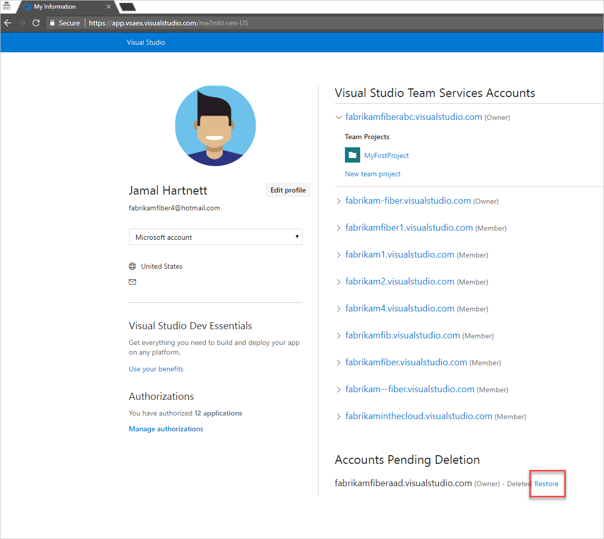

# Restore your Visual Studio Team Services account

**VSTS**

Your account will be disabled but available for 90 days after you delete it. 
If you change your mind during this time, you can recover your account. 
After 90 days, your account and data are permanently deleted.

You'll need VSTS account owner 
permissions to restore your VSTS account. 
[How do I find the account owner?](faq-delete-restore-vsts-account.md#find-owner)

0.	Sign in to your [Visual Studio profile](https://app.vsaex.visualstudio.com/profile/view).

	[Why am I asked to choose between my work or school account and my personal account?](#ChooseOrgAcctMSAcct)

0.  Restore your account.

	

	*	If your account URL is still available, you can restore your account.

		

	*	If your account URL isn't available, provide a new URL.

       

0.  After you restore your account:

	*	If billing was set up for your account, you'll have to set it up again. Just 
[relink your account](../billing/set-up-billing-for-your-account-vs.md) to an Azure subscription.

	*   If your account was connected to Azure AD for authenticating user access, you won't have to reconnect it again.

	[Need help?](#get-support)

[Troubleshooting](faq-delete-restore-vsts-account.md)

