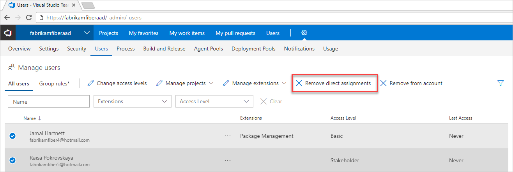

# Remove direct assignments from users

**VSTS**

If you want a user’s resources to only be managed by the groups which they are in, you must remove their direct assignments. If a user has resources assigned to them directly (via individual assignment), they will be assigned those resources whether or not they are assigned or taken away from groups they are in.

## Prerequisites

* You must be a member of the Project Collection Administrators group for the account which you would like to manage users' direct assignments.

## Remove assignments

1. Sign in to your VSTS account (```https://{youraccount}.visualstudio.com```).

2. Go to the **Users** tab in Settings.

3. Select all users with resources that should only be managed by groups.

4. Choose **Remove direct assignments** from the command bar or right-click and choose from the menu.

   

5. Choose **Remove** to confirm that you would like to remove the direct assignments.

Direct assignments are removed from the users.

>[!Note: If the user is not a member of any groups, they will not be affected.]

## Related information

* [What is Azure AD B2B Collaboration?](https://docs.microsoft.com/en-us/azure/active-directory/active-directory-b2b-what-is-azure-ad-b2b)

* [Migrate to group-based resource management](migrate-to-group-based-resource-management-in-VSTS.md)

* [Assign access levels and extensions to users by group membership](assign-access-levels-and-extensions-by-group-membership.md)
