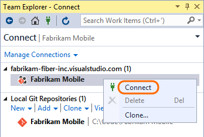

# Rename a team project

**Team Services** | **TFS 2015**

A team project rename updates all of your version control paths, work items, queries, and other team project artifacts to reflect the new name. 
Team projects can be renamed multiple times and older names can be reused as well. 
Post rename, there might be some [reactions](#more-work) required from team members. It is recommended to perform this action during off-hours to minimize any impact.

## Perform a team project rename

### From the team project administration page

You can change the name of a team project from its administration overview page.

1. Open the administration overview page by choosing the  gear icon in the top right.

2. Edit the name. 

	
	
	If you don't see the textbox appear, then you're not a member of the Project Administrators group for that particular project. Learn how to [get added](./add-users.md) to the Project Administrators group.

### From the project collection administration page

You can also change the name of a team project from the project collection administration page.

1. From your account's home page, use the  gear icon to open the control panel and then go to the project collection administration page.

2. Rename the team project from its context menu.

	

	If the rename action is disabled, then you're not a member of the Project Administrators group for that particular project. Learn how to [get added](./add-users.md) to the Project Administrators group.


<a id="more-work"></a>
## Let your team know what they have to do

Now that you've renamed your team project,
your team will need to restart their clients and perform additional actions based on the features they use. 

<a id="restarting-clients"></a>
### Restart your clients
Opened clients keep a cache of all team project names in memory and this cache isn't automatically cleared after a team project is renamed. 
To clear the cache, all that is necessary is to restart the client so it populates the new team project name.
If you don't restart the client, then operations that use the cached team project name will
fail with a project not found exception.

For the following clients, save your work in each and restart:

- Visual Studio/Team Explorer

- Eclipse, if your team uses the Team Foundation Server plugin (Team Explorer Everywhere)

- Microsoft Excel, PowerPoint, or Project, if your team uses the Team Foundation Server Extension for these Office products
 
- Any additional clients which use the .NET Team Foundation Server Client Object Model

<a id="git"></a>
### Update your Git remotes
If your team project uses Git, then your remote references for each repository from the renamed team project need to be updated. This is due to the fact that the remote repository URL contains the team project and the repository name. Git uses remote references to fetch and push changes between your local copy of a repository and the remote version stored on the server. Each member of your team must update their local Git repos to continue connecting from their dev machines to the repo in the team project. 

<a name="copy_remote_repo_url"></a>
#### Get the new URL for the repo

Copy the repository URL to your clipboard.


#### Update your remote in Visual Studio 2015

1. Connect to the repo.

 
 
2. Open the project settings.
 
 

3. Open the repo settings.

 

4. Edit the fetch and push remote references and paste the URL that you [copied from the remote repo](#copy_remote_repo_url).

 

#### Update your remote in older versions of Visual Studio from the command prompt

If you use an older version of Visual Studio or work with Git from the command prompt:

1. Open the Git command prompt.

2. Go to the local repository and update the remote to the URL you [copied from the remote repo](#copy_remote_repo_url).

    ```git remote set-url origin {URL_you_copied_from_the_remote_repo}```

#### Refresh Team Explorer

1. Refresh Team Explorer.

 

2. Team Explorer now shows the updated repo name. 

 


<a id="tfvc-server"></a>
### Update your TFVC server workspaces
If your team project uses TFVC with [server workspaces](../tfvc/decide-between-using-local-server-workspace.md), these workspaces will need to be updated with the new project name. 
For the following clients, execute a get or check-in and the workspace mapping will be corrected to use the new team project name:

- Visual Studio 2015 (RC or newer)

- Visual Studio 2013

- Visual Studio 2012

- Visual Studio 2010 (Only supports server workspaces)

- Team Explorer Everywhere (2012 or newer)


<a id="tfvc-local"></a>
### Update your TFVC local workspaces
If your team uses TFVC with [local workspaces](../tfvc/decide-between-using-local-server-workspace.md), these workspaces will need to be updated with the new project name.
For the following clients, execute a get or check-in and the workspace mapping will be corrected to use the new team project name:

- Visual Studio 2015 (RC or newer)

- Visual Studio 2013 with [Update 5](http://go.microsoft.com/fwlink/?LinkId=519378) (RC or newer)

- Visual Studio 2012 with [Update 5](http://go.microsoft.com/fwlink/?LinkId=615776) (RC or newer)

- Team Foundation Server plugin [Team Explorer Everywhere 2015](http://go.microsoft.com/fwlink/?LinkID=617042)

It's recommended you update your clients to the latest update or release, if possible. For all other supported Visual Studio versions, 
except for Visual Studio 2010 which only supports server worksapces, 
and Team Foundation Server plugin for Eclipse, 
you will need to create a new local workspace mapped to the new team project name.

1.  [Shelve your changes](https://msdn.microsoft.com/library/ms181404).

2.  [Create a new workspace](https://msdn.microsoft.com/library/ms181383.aspx) mapped to the new team project name.

3.  Unshelve your changes.

Since local workspaces are managed locally and not on the server, older clients without the updated rename logic are unable to update local workspaces to the new team project name on the next get or check-in. 
 
<a id="tfs-onprem"></a>
### Update your Team Foundation Server SharePoint and Reporting Integrations (on-premises)
Both SharePoint and Reporting Services integrations continue to work, but some reports will not work as expected until the new team project name is populated.
The old project name is still present until caches are updated with the new name. 
The reporting and SharePoint server administrator can manually run these jobs to immediately populate the new name. 

- If your team uses reports, they will reflect the new names after the next incremental analysis job runs for the data warehouse.
By default it runs every two hours.
To expedite the process,
[manually run the warehouse jobs and incremental analysis job](../report/admin/manually-process-data-warehouse-and-cube.md)
so the new name gets synced to warehouse and reports start using the new name.
Reports will not work as expected until the jobs have run.

- If your team uses SharePoint Integration and has custom queries or web parts which directly reference the team project name,
 update the name in each to the new team project name. All default queries and web parts do not need to be updated and will continue to work. 
 Uses of *@project* will also continue to work after a team project rename and also don't need to be updated. 

- Excel reports and Excel web parts on MOSS will not show the right data until the execution of a couple of jobs.
	1. Warehouse job – [Run the warehouse jobs](../report/admin/manually-process-data-warehouse-and-cube.md)
	so that Excel reports contain the correct data.
	If the new project name is not synced to the warehouse,
	Excel reports will not show the correct data.
	To avoid this, manually run warehouse jobs.
	2. SharePoint timer job – Run the "Team Foundation Server Dashboard Update" job
	from the SharePoint central admin to update Excel web parts on the dashboard. 
	By default, it runs every 30 minutes.
	Until this job runs, the Excel web parts on the dashboard
	and the web parts that show reports directly from the reporting folder
	won't work because they'll use either the wrong project name or the wrong reporting folder. 
	3. SharePoint cache – Manually clear the SharePoint cache to avoid stale data,
	such as report folder locations, appearing in the dashboards.
	By default, this cache clears about every hour.
	You can also clear some TFS specific cache using the tfs redirect url
	and providing a "clearcache" parameter. For example

		```http://<SharePointServer>/sites/<TeamProjectCollectionName>/<TeamProjectName>/_layouts/TfsRedirect.aspx?tf:type=Report&tf:clearcache=1```

## Q&A

<!-- BEGINSECTION class="m-qanda" -->

#### Q: What permission do I need to rename a team project?

If you're using Team Services or Team Foundation Server 2017 or later, team project rename requires the "rename team project" permission for a team project.
If you're using Team Foundation Server 2015, users require "edit project-level information" permission on a team project to rename it. 

#### Q: Can I use a team project name again?

Yes, team project names can be reused.

#### Q: Why did my attempt to reuse a team project name fail due to existing workspaces?

A team project name can't be reused if there are still workspace mappings addressing it. 
This is done to avoid the ambiguity case where a workspace could be mapped to two projects. 
You will need to reach out to the users that have these mappings, and either delete them or [update them](#tfvc-server) to use the new name. 
If the user's machine containing the workspace is no longer available then you can delete the workspace 
by running the following command from Visual Studio's developer command prompt:

```tf workspace /delete [/collection:TeamProjectCollectionUrl] workspacename[;workspaceowner]```


#### Q: How does renaming a team project impact my browser navigation experience?

After a team project is renamed, any browsers with the team project opened may encounter some errors. These errors are due to caches held by the browser which include the old team project name. 
Refreshing will make these errors go away since the cache will be repopulated with the new team project name.
	
#### Q: Do other artifacts in the team project get renamed when it is renamed?

Yes, all artifacts which share the same name get renamed along with the team project. The only exceptions to this are for the default team room, team, and repo. The rename of those artifcats is done as a best effort. 
For example, if a team project Foo was renamed to Bar, the default team Foo would not be renamed if a team named Bar already existed in the team project. 

#### Q: Why can't I open queries saved to disk after a rename?

If you use Visual Studio 2010 and you have queries save to disk, you will not be able to open them after a team project is renamed. You can use Visual Studio 2012 or newer to open them.

#### Q: Why does the existing Lab Management BDT in Visual Studio fails with the error 'oldprojectName' cannot be found?

The issue is encountered when Build Controller 2013 is used with TFS 2015. To fix the issue, open the existing Build Definition, select the process tab under it, click on the ellipses next to the Lab Process settings to
open the Lab Workflow Parameters wizard, and then click on Finish. The issue is permanently resolved by using the TFS 2015 Build Controller that ships with TFS 2015.


	 
<!-- ENDSECTION -->