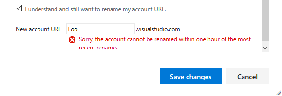

# Rename your VSTS account

**VSTS**

You can change your VSTS account name (URL) at any time.

**Caution**: This affects your account's connections 
and those currently working with your account. 
So before you start, find out 
[what to do before and after renaming your account](https://support.microsoft.com/kb/2793597).

To change your VSTS account URL, 
you'll need at least Basic access and account owner permissions. 
[How do I find the account owner?](faq-delete-restore-vsts-account.md#find-owner)

0.  Sign in to your VSTS account (```https://{youraccount}.visualstudio.com```).

	[Why am I asked to choose between my work or school account and my personal account?](faq-create-account.md#ChooseOrgAcctMSAcct)

0.  Go to your VSTS account settings.

    

0.	Under **Settings**, change your account URL.

    

0.  Confirm that you want to rename your account. 
Give your account a new name. Save your changes.

    


**NOTE**: You cannot rename your current account to the name that was used an hour ago.

E.g.) Suppose that you have two accounts and want to switch "Foo" to "Bar" and vice versa.
1. Foo.visualstudio.com to Bar.visualstudio.com
2. Bar.visualstudio.com to Foo.visualstudio.com

Changing the name of the first account from "Foo.visualstudio.com" to "Baz.visualstudio.com" will prevent you renaming "Bar.visualstudio.com" to "Foo.visualstudio.com" for an hour.



[Need help?](faq-create-account.md#get-support)
