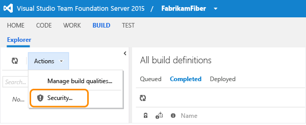

# Restrict access in VSTS and TFS

**VSTS** | **TFS 2017** | **TFS 2015** | **TFS 2013**

You can restrict access to resources that you manage in TFS or VSTS by setting the permission state to Deny through a security group. For a comprehensive list of default groups and permissions, see [Permission reference for Team Foundation Server](../security/permissions.md).

## TFVC

From the Version Control tab in the TWA administration context, you can set permissions for a group or individual.

  

## Git

For team projects that use Git for version control, you can set the following permissions.

  
For additional information, see [Permission reference for Team Foundation Server](../security/permissions.md).

## Build definitions

From the Build hub in TWA, you can set build permissions at the project level for a group or individual.

  

You can set permissions for the build operations shown in the following image.

  

Also, you can set permissions by opening the  context menu for a build definition.  
For additional information, see [Permission reference for Team Foundation Server](../security/permissions.md).

## Work items

### Changing work items

By [setting permissions on an area path](../security/set-permissions-access-work-tracking.md), you can deny a group or individual the ability to create or edit work items assigned under an area path.

[Set a condition field rule](../work/customize/reference/apply-rule-work-item-field.md), [a condition-based field rule](https://msdn.microsoft.com/library/ms194966.aspx) or a combination of the two that applies to a group. You can restrict changes from being made to a field by specifying a qualifying rule and making it apply for a specific group. Conditional rules can include **CANNOTLOSEVALUE**, **EMPTY**, **FROZEN**, **NOTSAMEAS**, **READONLY**, and **REQUIRED** elements.

### Creating specific types of work items

You can restrict access in one of two ways:

-   By [adding WITs to the Hidden Categories group](https://msdn.microsoft.com/library/dd695775.aspx), you can prevent the majority of project contributors from creating them. You [can create a hyperlink to a template](https://msdn.microsoft.com/library/ff407162.aspx) that opens the work item form and share that link with those team members who you do want to create them.  
-   By adding [a field rule to the workflow](../work/customize/reference/apply-rule-work-item-field.md) for the System.CreatedBy field, you can effectively restrict a group of users from creating a work item of a specific type. As the following example shows, the user who creates the work item must belong to the `Allowed Group` in order to save the work item.

        <TRANSITION from=" " to="New">
           <FIELDS>
             <FIELD refname="System.CreatedBy">
                <VALIDUSER for="Allowed Group" not="Disallowed Group" />
             </FIELD>
           </FIELDS>
        </TRANSITION> 

For more information about how to customize WITs, 
see [Modify or add a custom work item type (WIT)](../work/customize/add-modify-wit.md).

## Work item queries

[Set permissions on a shared query or query folder](../security/set-permissions-access-work-tracking.md) 
to restrict who can modify the query or queries within the folder.
