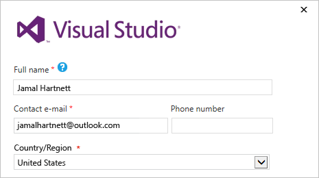
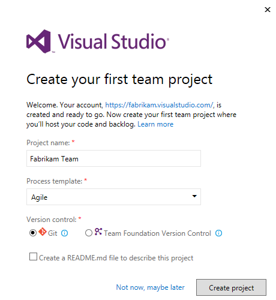

#	Set up Visual Studio with VSTS

**VSTS**

When you first launch [Visual Studio 2015](https://www.visualstudio.com/products/vs-2015-product-editions), 
you can sign in and connect to [VSTS](https://www.visualstudio.com/products/visual-studio-team-services-vs).

If you have already gone through Visual Studio sign in, or you are using Visual Studio 2017, then [learn how](../git/gitquickstart.md) to connect to 
your VSTS from the Team Explorer window.

Once connected, you can store or share code in free, unlimited, private, 
cloud-based Git repositories or Team Foundation version control. 
Organize and manage your work using Agile tools for DevOps, 
continuous integration, and continuous delivery so your team can build often, 
test early, and ship faster.

> To set up Visual Studio without VSTS, 
> learn how to [get started here](https://msdn.microsoft.com/library/e2h7fzkw.aspx). 
> To host your own server, 
> learn how to [install and set up Team Foundation Server](../tfs-server/install/get-started.md).

VSTS is free for 
[up to 5 users with access to Basic features](https://www.visualstudio.com/products/visual-studio-team-services-feature-matrix-vs) 
and for unlimited [Visual Studio subscribers](https://www.visualstudio.com/products/how-to-buy-vs) and 
[Stakeholders who can access limited features](https://www.visualstudio.com/products/visual-studio-team-services-feature-matrix-vs).
Learn [what else you get with VSTS](https://www.visualstudio.com/pricing/visual-studio-team-services-pricing-vs). 
If you want, you can also use VSTS with any IDE or code editor, like:

*	[Eclipse, Android Studio, or IntelliJ](http://java.visualstudio.com/Docs/tools/intro)
*	Xcode (see [Git](../git/share-your-code-in-git-xcode.md) or [TFVC](../tfvc/share-your-code-in-tfvc-xcode.md))
*	[Visual Studio Code](https://code.visualstudio.com/docs/editor/versioncontrol)

##	How do I set up Visual Studio 2015 for VSTS during sign in?

0.  [Download and install Visual Studio](https://go.microsoft.com/fwlink/?LinkId=309297&clcid=0x409&slcid=0x409), 
if you don't have the version you want already. 
[Which versions can I use with VSTS?](#vs-versions)

	If you have a Visual Studio subscription that 
	includes the Visual Studio IDE, get the version 
	that's available with your subscription.

0.  Start Visual Studio, 
then sign in to create your profile. 

	This profile saves your settings and roams with you 
	when you sign in to Visual Studio on any computer. 
	[Why else should I sign in?](#why-sign-in)
	If you're a Visual Studio subscriber, 
	use the sign-in address for your subscription. 

	

	[Can't sign in?](#cannot-sign-in)

0.	Enter your sign-in address, 
then enter your password.

0.	Add your Visual Studio profile details. You only have to do this once. 

	

0.	Give your VSTS account a name, 
and confirm its location. 

	

	[How can I create a VSTS account later](#WhatIsVSO) or [change its location?](#change-location)

0.	Create your first team project to store your code, 
work items, backlog, builds, tests, and other assets. 
Name your team project, select a process to organize your work, 
and choose the version control to manage your code.

	

	Not sure which to choose? Learn which 
	[process](../work/work-items/guidance/choose-process.md) 
	and version control ([Git](../git/overview.md) 
	or [Team Foundation Version Control](../tfvc/overview.md))
	work best for you.

0.	If you're a new Visual Studio user, you can change your settings here, 
or change them later in Visual Studio options.

	

	These changes are saved with your profile, 
	and your settings roam with you wherever you sign in. 

0.	To view your new VSTS account, 
	sign in to ```https://{youraccount}.visualstudio.com```. 

    [Having browser problems with VSTS?](#browser-problems)

####	Next

*	[Add users to your VSTS account](add-account-users-assign-access-levels.md)

*	Add code to [Git](../git/share-your-code-in-git-vs.md) 
or [Team Foundation](../tfvc/share-your-code-in-tfvc-vs.md) version control

*	[Create your backlog](../work/backlogs/create-your-backlog.md) to organize your work, 
	[manage your process](../work/customize/process/manage-process.md), 
	or [customize your process](../work/customize/process/customize-process.md)

## Q & A

### Visual Studio 

<!-- BEGINSECTION class="md-qanda" -->

<a name="why-sign-in"></a>
####Q: Why sign in?

A:	Your Visual Studio settings, 
like automatic brace completion, 
are saved with your profile. 
These settings roam with your [personal Microsoft account](https://www.microsoft.com/account), 
or your [work or school account](https://azure.microsoft.com/en-us/documentation/articles/sign-up-organization/), 
when you sign in to Visual Studio on any computer. 

Sign in to Visual Studio during the 30-day 
trial period for these benefits:

*	Visual Studio Enterprise: Extend your trial for 90 days. When your trial expires, 
learn [how to unlock Visual Studio](https://msdn.microsoft.com/library/dn950037.aspx).
*	Visual Studio Express or Community: Continue to use this edition for free

When you create your profile, 
you can also create a VSTS account. 

Learn more about 
[the benefits of signing in and creating a profile](https://msdn.microsoft.com/library/dn457348.aspx). 

<a name="cannot-sign-in"></a>
####Q: Why can't I sign in?

A:	To create a profile and save your settings, 
you'll need to sign in with a [personal Microsoft account](https://www.microsoft.com/account) 
or a [work or school account](https://azure.microsoft.com/en-us/documentation/articles/sign-up-organization/) 
that's managed by Azure Active Directory.

<a name="vs-versions"></a>

[!INCLUDE [visual-studio-versions](../_shared/qa-visual-studio-versions.md)]

####Q: Can I use Visual Studio 2015 with Visual Studio 2013 and 2012 on the same computer?

A:	Yes, you can run all these versions on the same computer.

####Q:	My subscription expired. What do I do?

A:	Here's [how to unlock Visual Studio](https://msdn.microsoft.com/library/dn950037.aspx). 
If you're having subscription problems, 
try [Subscription Support](https://www.visualstudio.com/support/subscription-support-vs).

####Q:	I'm having problems installing or signing in to Visual Studio. How do I get help? 

A:	Learn more about:

*	[Installing Visual Studio](https://msdn.microsoft.com/en-us/library/e2h7fzkw.aspx).
*	[Signing in to Visual Studio](https://msdn.microsoft.com/library/dn457348.aspx).
*	[Managing multiple user accounts](https://msdn.microsoft.com/en-us/library/dn872465.aspx).

Or contact [Visual Studio Support](https://www.visualstudio.com/support/support-overview-vs). 

<!-- ENDSECTION -->

### VSTS

<!-- BEGINSECTION class="md-qanda" -->

<a name="WhatIsVSO"></a>
####Q: How can I create a VSTS account later?

A:	Learn how to [sign up for VSTS](create-account-msa-or-work-student.md).

<a name="browser-problems"></a>

[!INCLUDE [browser-problems](../_shared/qa-browser-problems.md)]

[!INCLUDE [find-account-name](../_shared/qa-find-account-name.md)]

[!INCLUDE [recover-password](../_shared/qa-recover-password.md)]

<a name="change-location"></a>
####Q: Can I change my VSTS account location?

A:	Yes, for a better experience, 
you can change your account's location during signup 
so that your account is closest to most users.


Your account's default location is selected based on the closest 
[Microsoft Azure region](https://azure.microsoft.com/en-us/regions) 
where VSTS is available. 

[!INCLUDE [secure-protect-data](../_shared/qa-secure-protect-data.md)]

[!INCLUDE [team-services-sla](../_shared/qa-vsts-sla.md)]

[!INCLUDE [change-account-name-owner](../_shared/qa-change-account-name-owner.md)]

[!INCLUDE [delete-account](../_shared/qa-delete-account.md)]

[!INCLUDE [get-team-services-support](../_shared/qa-get-vsts-support.md)]

<!-- ENDSECTION -->
