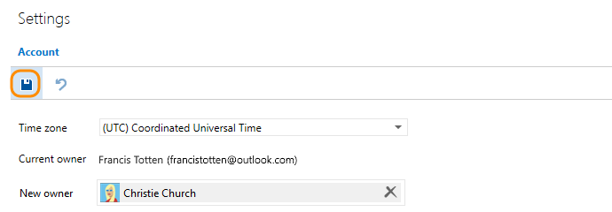

#  Change account owner for Visual Studio Team Services

**Team Services**

When your team's roles and responsibilities change, 
you can change your Team Services account owner to another user. 

<a name="ChangeOwner"></a>
## Before you start

You must have at least Basic access, not Stakeholder, and Team Services 
[project collection administrator or account owner permissions](#find-owner-pca). 
If no one has these permissions, contact 
[Team Services Support](https://www.visualstudio.com/team-services/support).

Make sure that the new owner: 

*	Has been added and invited to your Team Services account 
(```https://{youraccount}.visualstudio.com```).

*	Also has at least Basic access, not Stakeholder. 
Learn [how to manage users and access](add-account-users-assign-access-levels-team-services.md). 

*	Has signed in to your Team Services account, 
created a Visual Studio profile, 
and agreed to the Terms of Service. 

##	Change Team Services account owner

0.	Sign in to your Team Services account 
(```https://{youraccount}.visualstudio.com```). 

	[Why am I asked to choose between my work or school account and my personal account?](#ChooseOrgAcctMSAcct)

0.	To find the current account owner, 
go to your Team Services account settings

	

0.	Under **Settings**, find the current owner.

	

0.	Change the account owner.

	

0.	Find and select the new owner.

	

	[Can't find the person you want?](#NoNewOwner) 

0.	Save your changes.

	

	Your Team Services account has a new owner! 

<a name="article12"></a>
##  Q&A

<!-- BEGINSECTION class="md-qanda" -->

<a name="find-owner-pca"></a>

[!INCLUDE [find-project-collection-administrator](../../_shared/qa-find-project-collection-administrator.md)]

[!INCLUDE [find-account-owner](../../_shared/qa-find-account-owner.md)]

<a name="NoNewOwner"></a>
####Q: Why can't I find the user I want to make the new owner?

A: This might happen because:

*	They're not in your Team Services account, 
or they don't have account access. 
Learn how to [add them to your account](add-account-users-assign-access-levels-team-services.md).

*	They haven't created a Visual Studio profile 
and agreed to the Terms of Service.

*	If you recently added this person to your account, 
you might experience a delay before this person appears 
in the possible account owners list. 

*	If your account uses Azure Active Directory to control access, 
directory members won't appear in the possible account owners 
list until they meet the requirements above.

[!INCLUDE [recover-password](../../_shared/qa-recover-password.md)]

####Q: Can I reverse the account owner change?

A: Yes, if you're a project collection administrator.

####Q: Can I change the account name (URL) too?

A: Only the account owner can change the URL. 
If you're the account owner, learn how to 
[change the account URL here](rename-visual-studio-team-services-account.md).

####Q:	How many account owners can I have?

A:	Your account can have only one owner. 
Only they can [perform certain actions](#owner-differences), 
so make sure to keep your account owner updated.

####Q: Why did you ask for extra information when I signed in?

A: If our Terms of Service have changed since you last signed in, 
you might be asked to agree and confirm that your information is up to date.

<a name="owner-differences"></a>
####Q: What makes the account owner different than other account users?

A: The account owner manages payments and access for account users. 
They're also the same person who manages billing for the account through the 
[Azure classic portal](https://manage.windowsazure.com/) or the
[Azure portal](https://portal.azure.com). 

Account owners also have permissions to perform these tasks:

*	Pay for users accessing the account
*	Pay for additional account services
*	Rename the account URL
*	Change the account owner

In contrast, project collection administrators can manage user access 
and change the account owner, but they can't rename the account URL.

<a name="ChooseOrgAcctMSAcct"></a>

[!INCLUDE [choose-msa-azuread-account](../../_shared/qa-choose-msa-azuread-account.md)]

[!INCLUDE [choose-msa-azuread-account2](../../_shared/qa-choose-msa-azuread-account2.md)]

[!INCLUDE [why-cant-sign-in-msa-azuread-account](../../_shared/qa-why-cant-sign-in-msa-azuread-account.md)]

[!INCLUDE [why-no-owned-accounts](../../_shared/qa-why-no-owned-accounts.md)]

<a name="get-support"></a>

[!INCLUDE [get-team-services-support](../../_shared/qa-get-team-services-support.md)]

<!-- ENDSECTION --> 