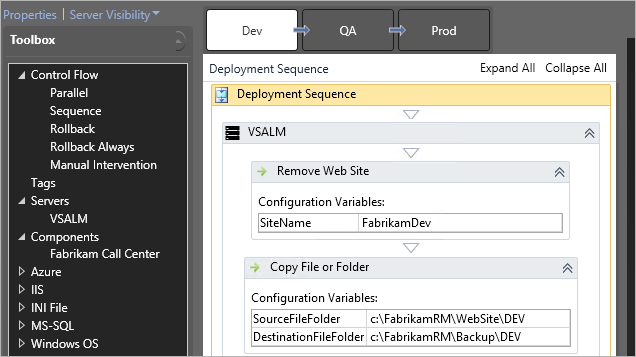

# Build and Deployment Automation Case Study for World Wide Time Keeping: Higher Quality and Faster Delivery in an Increasingly Agile World

> Author: Vaibhav Rajeev Thombre

October 2015

## Introduction 

In an Agile world, delivering quick and frequent releases for large, complex systems with multiple components 
becomes cumbersome and time-consuming if done manually, because each component has a high degree of complexity and 
requires a lot of resource intervention and configuration to ensure that it works as expected.

That's why many teams opt for Build and Deployment Automation to ensure faster releases and reduce manual 
intervention. However, automating multiple components of a system has its own challenges. Even though releases can be 
automated in silos, if we need a one-click deployment for the entire system, we need to have an 
automation framework that can automate an entire custom workflow.

Throughout this paper, we give insight on our project - World Wide Time Keeping - and how we implemented build 
and deployment automation using Gated Check-ins, Code Analysis, and Fortify Integrations. We discuss build and 
deployment automation by using PowerShell scripts and how we can create custom workflows and deploy all at once 
using Release Management. We also talk about how these can help you cut down your engineering cycle time and 
play an important role in hitting Production Ready at Code Complete (PRCC) goals. This lets you have a 
Continuous Integration Continuous Delivery (CICD) Project and helps you go faster, without introducing issues.

This content is useful for SWE teams who are working in an Agile model for large, complex systems and want 
to cut down their release cycles and deliver faster. We assume that readers have a fundamental knowledge 
of Engineering Cycles and their phases (Develop/Test/Build/Deploy) and a fundamental knowledge of Agile practices 
and delivery cycles.

## Build Automation

Many teams have multiple requirements for build, but the following practices can be applied to most teams. 
You may adopt the whole approach or just implement the components that work out best for you.

**Daily Builds:** Have a build pipeline for scheduled builds. Aim for a daily schedule with builds 
released to the internal SWE environment by the end of each day.

**One-click builds for non-internal environments:** For Integration/UAT environments, you automate the builds. 
Instead of scheduling them on a per day basis, you can trigger them by queuing them in VSTF. (The reason for 
not scheduling them is that a build is not required on Integration/UAT environments on a daily basis. Rather, 
they tend to happen on an as-needed basis. This will depend on your team's needs and you can adopt the rhythm 
that works best for your team.)

**Gated Check-ins:** Set up gated check-ins to ensure that only code that complies and passed unit testing 
gets checked in. It ensures that code quality remains high and that there are no broken builds. Integrate Fortify 
and Code Analysis to get further insight into code quality.

**Code Analysis Integrations:** To get insight into whether the code is of good quality or if any changes need to be made, 
integrate Code Analysis into the build pipelines and set the threshold to low. The changes 
can be identified and fixed early, which is required in the Agile world.

**Fortify Integrations:** Use Fortify for security-based checks of the build pipelines associated with 
your check-ins and daily builds. This ensures that any security vulnerabilities are identified 
as soon as possible and can be fixed quickly.

##	Deployment Automation 

### Using Deployment Scripts

**Deployments for internal SWE environment:** Set up the internal SWE environments deployments with the 
daily automated builds by integrating the build pipelines with the deployment scripts. All the 
checked-in changes will then be deployed at the end of each day, without any manual intervention.

This way, the latest build is present in the SWE environment in case you would like to demo the 
product to stakeholders.

**Deployments for Integration/UAT environments:** For Integration/UAT environments, you can integrate the
scripts with the build pipelines without scheduling them and trigger them on an as-needed basis. 
Because you have set up one-click builds for them, when the build completes successfully, the scripts get 
executed at the end and the product is deployed. Therefore, you do not have to manually deploy the 
system. Instead it's deployed automatically by simply queuing a build.

### The Release Pipeline

In theory, a release pipeline is a process that dictates how you deliver software to your end users. 
In practice, a release pipeline is an implementation of that pattern. The pipeline begins with code 
in version control and ends with code deployed to the production environment. In between, a lot can happen. 
Code is compiled, environments are configured, many types of tests run, and finally, the code is 
considered "done". By done, we mean that the code is in production. Anything you successfully put 
through the release pipeline should be something you would give to your customers. Here is a diagram 
based on the one you will see on Jez Humble's
[Continuous Delivery](http://continuousdelivery.com/) website. It is an example of what can 
occur as code moves through a release pipeline.

### Using Release Management

If your team is working on Azure-based components - web apps, services, web jobs, and so on - you can use 
Release Management for automating deployments.

Release Management consists of various pre-created components which you can configure and use either 
independently or in conjunction with other components through workflows.

You might face pain points when you manually deploy an entire system. For a large complex system 
with multiple components, like service, web jobs, and dacpac scripts, here are example pain points:

*   A large amount of time goes into configuration of each component

*   Deployment needs to be done separately for each, adding to the overall deployment time.

*   Multiple resources have to be engaged to ensure that the deployments happen as expected.

How Release Management (RM) solves them:

*  RM allows you to create custom workflows which sequence the deployment to ensure that 
the components get deployed as soon as their dependencies have been deployed.

*  Configurations can be stored in RM to ensure that configuration per deployment is not required.

*   It automates the entire workflow which ensures manual intervention is not required and resources 
can be utilized for functional tasks.
 
**Key takeaways**

*	Set up Automated Builds scheduled for the rhythm that works best for your product and Implement 
Gated Check-ins.

*	Integrate Code Analysis and Fortify into the build setup to improve the code quality and security 
of the application

*	Set up daily automated deployments to the internal SWE environments and set up one click deployments 
to environments like UAT and Prod.

*	Use Release Management to set up custom workflows for your releases and triggering them with a single click.

To use Release Management, you need to set up the following components:

*	**RM Server**: Is the central repository for configuration and release information.

*	**Build Agent**: This is a machine (physical or VM) that you set up at your end on which you will 
run all your builds and deployments.

*	**Environments**: This signifies the environment which will be used in conjunction with your machine 
that you have set up.

*	**Release Paths**: You need to create Release Paths for the multiple releases that you want to 
automate for multiple environments - internal SWE envs, INT, UAT, and so on.

*	**Build Components**: The build component is used configure the build and change any environment 
specific configurations. It picks up the build from the remote machine in which VSTF auto-generates 
the builds as per the build pipeline and runs the configuration changes that are defined within it.

*	**Release Templates**: Release template defines the workflow that you have set up as per your specific 
needs of deployment. It also defines the sequence in which the RM components are to get executed. You need 
to integrate your build pipeline from Team Foundation Server (TFS) with the release template to enable 
continuous delivery. You can either pick up the latest build or select the build.

	

##	Conclusion

In this paper, we discussed the various engineering practices we can use for enabling faster product 
delivery with higher quality. We discussed:

*   **Build Automation**: Builds can be set up for triggering on a schedule or on an ad-hoc basis 
just by a single click. It can vary based on the rhythm that works best for your team. Gated 
check-ins should be set up on top of the build pipelines to accept only the check-ins which meet 
the criteria bar.

*   **Code Analysis and Fortify Integration**: The build pipelines should be integrated with Code 
Analysis and Fortify to trigger on a schedule and also with the Gated Check-ins. Code Analysis 
will improve the code quality and Fortify will point out the security-based gaps in the application, 
if any.

*   **Deployment Automation**: You can integrate PowerShell scripts with your build pipelines to achieve 
deployment automation. You can also use Release Management to set up custom workflows and integrate it with 
your TFS to pick up the latest builds or even select builds.

We also discussed the benefits that we found by taking up these practices:

*   Minimal wastage of time due to automations of build, deploy phases

*   Higher code quality due to Gated check-ins (with integrated Test Automation), Code Analysis, 
and Fortify Integration

*   Faster delivery

*   Will enable you to hit Production Ready at Code Complete (PRCC)

*   Will enable you to hit Continuous Integration & Continuous Delivery targets (CI/CD)

## References

[1] Visual Studio team, 
[Automate deployments with Release Management](https://msdn.microsoft.com/Library/vs/alm/Release/overview), 
MSDN Article

[2] Visual Studio team, 
[Build and Deploy Continuously](https://msdn.microsoft.com/library/ee308011%28v=vs.100%29.aspx), 
MSDN Article

[3] Visual Studio team, 
[Building a Release Pipeline with Team Foundation Server 2012](https://msdn.microsoft.com/library/dn449957.aspx), 
MSDN Article

*(c) 2015 Microsoft Corporation. All rights reserved. This document is
provided "as-is." Information and views expressed in this document,
including URL and other Internet Web site references, may change without
notice. You bear the risk of using it.*

*This document does not provide you with any legal rights to any
intellectual property in any Microsoft product. You may copy and use
this document for your internal, reference purposes.*