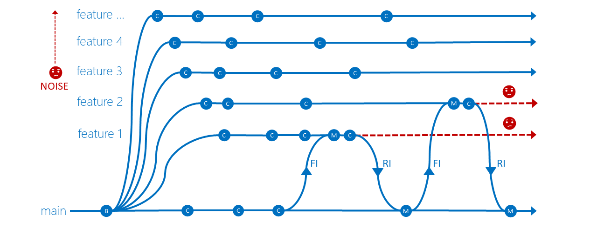

#Effective feature isolation on TFVC

Are you planning to implement Team Foundation Version Control‘s feature isolation strategy ([TFVC](https://msdn.microsoft.com/en-us/library/ms181237.aspx))? You probably have a few questions, such as:

- Is it practical with large development teams?
- Does it align well with your agile process(es)?
- What’s the proper lifetime of isolated feature branches? 

This topic aims to answer those questions, and give you a clear perspective on feature isolation in TFVC. (For guidance on TFVC branch strategies overall, read [Branching Strategies with TFVC](./branching-strategies-with-tfvc.md).) 

> [!NOTE]
> 
> This topic covers TFVC. For Git, refer to [adopt a Git branching strategy](./git-branching-guidance.md). 

#What's feature isolation?

The feature isolation strategy allows you work on your features or fix bugs in **feature** branches (also known as “topic branches”) based off your **main** branch, or **dev**, or other central branches. It isolates your changes from the rest of your team, allows you to experiment with a feature, and enables easy rollback or merging of changes with your parent branch.

> [!NOTE]
> 
> The reference to "feature" is **not** related to the Feature work item type. This strategy can be used with Epic, Feature, Program Backlog Item, User Story, or whatever work item type you've defined in your process. 

It’s typical to create one feature branch per feature or bug, but in this strategy, you can create a miscellaneous feature branch to isolate a couple of low risk features. 

Unlike Git branches, which are repository-scoped, TFVC branches are path-scoped and therefore not as lightweight. To workaround this, limit the number of and the lifetime of your TFVC feature branches, and [optimize your workspace](https://www.visualstudio.com/en-us/docs/tfvc/optimize-your-workspace) using explicit, implicit, cloaked, and non-recursive folder mappings, to improve performance, and to reduce required disk space on your machine.

> [!TIP]
> 
> Your workspace should contain only the files you need. Consider creating multiple workspaces to isolate and switch among multiple feature branches. To avoid confusing yourself, use a consistent naming convention for both your workspace and feature branch.

#Naming convention is important
Use a consistent naming convention for your feature branches. Branches should be self-describing and easily identified by your users. Some suggestions:

- features/username/description for work performed by an individual. For example, *features/sandra/sdk-java*.
- features/workitem for feature work associated with a specific work item. For example, *features/115673*.
- sprint/username/description for work done by an individual in a specific sprint. For example, *S53/bill/dictionary-refactor*.
- bugfix/username/bugid for work done specific to an engineering bug. For example, *bugfix/takashi/707*. 

#Creating feature branches

Create a feature branch when you need to work on a feature, typically within the context of a sprint or iteration.

To protect your parent branch and minimize merge conflicts, regularly forward integrate (FI) changes from the parent branch to your feature branch. It ensures that you resolve merge conflicts on your feature branch, not the parent branch.

This strategy also keeps features from getting out of sync with the parent branch, especially if your feature work is taking time or is blocked on the integration of another feature. Remember to FI before you reverse integrate (RI) your changes back to the parent branch!

> [!TIP]
>
> Keep your feature branch **short-lived**! 
> 
> Unlike main or other central branches, feature branches have a limited life time. They are scoped to features, bugs, and hot fixes, which are typically developed within a sprint or iteration. Consider removing your feature branch once your feature has met your team's definition of done [DoD](https://aka.ms/vsardod) and changes have been merged with the parent branch.

As the number of your feature branches increase, your storage requirements and branch hierarchy visualization noise increases. With only five feature branches, the diagram is already noisy and rapidly losing its monitoring qualities. Can you imagine the impact of your team creating hundreds of feature branches?
 

Similarly, the **Source Control Explorer** view becomes noisy and impractical as the number of branches increases. Unless you have a consistent naming convention, finding a specific feature branch among hundreds of feature branches is challenging.

> [!TIP]
>
> **Delete** your feature branch when you're done!

#Impact of deleting a feature branch

By [deleting](https://www.visualstudio.com/en-us/docs/tfvc/delete-restore-files-folders#delete-an-item) feature branches you minimise noise and focus on active feature development. 

Remember it's a soft delete and your history is not lost. You can show deleted branches as follows:

- Select **Tools > Options > Visual Studio Team Foundation Server**.
- From the submenu, select **Show deleted items in the Source Control Explorer** to view the deleted branch(es). 

If needed, you can also [restore](https://www.visualstudio.com/en-us/docs/tfvc/delete-restore-files-folders#restore-items-deleted-from-visual-studio) deleted branches and associated items. 

If no one in your team has destroyed a branch using the [destroy](https://www.visualstudio.com/en-us/docs/tfvc/destroy-command-team-foundation-version-control) command, you'll have the complete history needed for auditing and migration tools that rely on replaying history.

> [!NOTE]
>
> Use the [destroy](https://www.visualstudio.com/en-us/docs/tfvc/destroy-command-team-foundation-version-control) command with caution. It's a **permanent** delete!

So, by keeping your branches **short-lived** and adopting a **consistent naming convention**, the feature isolation strategy is effective for small and large teams. 

Now that you're using feature isolation, you should explore continuous integration, feature toggles, and other complementary strategies.

##Reference information
- [Branching Strategies with TFVC (new guidance)](./branching-strategies-with-tfvc.md)
- [Branching and Merging Guidance (latest copy of classic guidance)](https://vsardata.blob.core.windows.net/projects/TFS%20Version%20Control%20Part%201%20-%20Branching%20Strategies.pdf)
- [Continuous Integration](https://www.visualstudio.com/learn/what-is-continuous-integration/)
- [Feature Toggles](https://msdn.microsoft.com/en-ca/magazine/dn683796.aspx)
- [Team Foundation Version Control (TFVC)](https://www.visualstudio.com/en-us/docs/tfvc/overview)

> Author: Willy Schaub | Find the origin of this article and connect with the ALM Rangers [here](https://github.com/ALM-Rangers/Guidance/blob/master/README.md)
 
*(c) 2017 Microsoft Corporation. All rights reserved. This document is
provided "as-is." Information and views expressed in this document,
including URL and other Internet Web site references, may change without
notice. You bear the risk of using it.*

*This document does not provide you with any legal rights to any
intellectual property in any Microsoft product. You may copy and use
this document for your internal, reference purposes.*