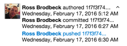

# How Dates Work in Git
## Reviewing the Git Date Fundamentals

> Authors: Ross Brodbeck

In this article I'm going to take a look at dates in Git. The subject doesn't make for good dinner conversation, but when you're blearily staring at a list of Git commits at 2 am, it certainly helps to know what they mean. 
Since there are three types of dates floating around with various formats and options, having a primer before you need the information can be useful.

## Author Date vs. Commit Date vs. Push Date

When looking at any particular Git commit, it helps to keep in mind there are actually three different types of date. 
Here's a look at the VSTS commit details section, so you can see what I mean:

* **Author Date** - This is the time you originally authored a commit. Basically, when you first ran `git commit`.
* **Commit Date** - This is the date your commit was *applied* to the branch. In many cases it is the same as the author date, but sometimes it will be different if you amended, rebased or someone else applied your commit as part of a patch. In those cases, the date will be when you rebased or the patch was applied.
* **Push Date** - This is the date you actually pushed your commit to the remote repository in question. This date is specific to the remote version control system you are using, and won't be available in your local repository.

When you run `git log`, by default you will see the *author date*. 
If you want to see commit date, you can use one of the many command line options, such as `--pretty=fuller`.

Let's look at a brief example to see these concepts in practice. First we will create a normal commit:

    git init
    echo test > file.txt
    git add *
    git commit -m "A normal commit message"

Now let's ammend our commit with a different message:

    echo again > file.txt
    git add *
    git commit --amend -m "An ammended commit"
    
If we look at our regular log history we would see something like the following:

    git log
    
    commit 17232459f0ae25adeff21c9e21742ba22b7f3499
    Author: Ross Brodbeck <robrodbe@microsoft.com>
    Date:   Thu Feb 25 19:38:54 2016 -0500

        An amended commit

Now let's view the same commit with the author date:

    git log --pretty=fuller
    
    commit 17232459f0ae25adeff21c9e21742ba22b7f3499
    Author:     Ross Brodbeck <robrodbe@microsoft.com>
    AuthorDate: Thu Feb 25 19:38:54 2016 -0500
    Commit:     Ross Brodbeck <robrodbe@microsoft.com>
    CommitDate: Thu Feb 25 19:39:36 2016 -0500

        An amended commit

Note the (slight) difference between the author date and commit date above.
The commit date is my original, unedited, commit time. The author date is the time at which I ran the `--amend` command.

In fact, there are a lot of fun `git log` command line options to help you understand dates better.
For example, passing the `--date` flag will allow you to determine how dates are displayed. 
This can be useful for normalizing time zones (git displays dates in their original time zone, by default) or changing the date display string.

To learn more about the various formatting options, see the [git log man page](https://git-scm.com/docs/git-log).

## Changing Git Dates

When you are getting ready to commit your code, you should note that you have the ability to set both the author and commit dates, although beware -- this isn't something you should do often.

You can change the author date of a given commit by passing the `--date` flag when you run `git commit`.
There are various articles regarding the formatting of this flag, but the gist is that it isn't well documented. [This stack overflow question](http://stackoverflow.com/questions/19742345/what-is-the-format-for-date-parameter-of-git-commit) does a great job of explaining the acceptable date formats.

You can also use the environment variables `GIT_COMMITTER_DATE` and `GIT_AUTHOR_DATE` to set the corresponding dates, as documented in the [man page](https://git-scm.com/docs/git-commit). 
If you need to go this route I would also [suggest a Stack Overflow question](http://stackoverflow.com/questions/454734/how-can-one-change-the-timestamp-of-an-old-commit-in-git) as a good place to start.

## Git Date Fundamentals

That wraps up our tour of date fundamentals in Git. Hopefully you now know:

* What the different types of dates mean in Git
* How you can change them and display them using the command line

*(c) 2016 Microsoft Corporation. All rights reserved. This document is
provided "as-is." Information and views expressed in this document,
including URL and other Internet Web site references, may change without
notice. You bear the risk of using it.*

*This document does not provide you with any legal rights to any
intellectual property in any Microsoft product. You may copy and use
this document for your internal, reference purposes.*