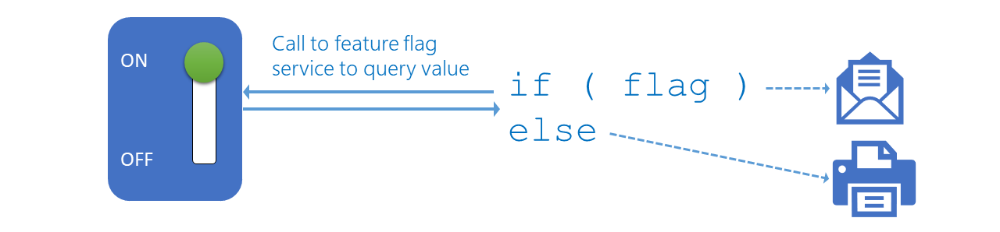
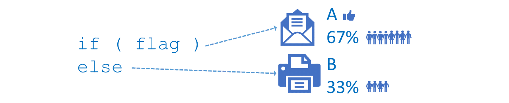

# Phase the features of your application with feature flags

In today's fast-paced, feature-driven markets, it is imperative to be able to deliver value and receive feedback on features quickly and continuously. Collaborating with end-users to get early versions of features vetted out is extremely valuable.

Are you planning to continuously integrate features into your application while they're under development? You probably have a few questions, such as:

- How can you toggle features to hide, disable, or enable features at run-time?
- How can you revert a change deployed to production without rolling back your release?
- How can you present users with variants of a feature, to determine which one performs better?

This topic aims to answer this and share our implementation of feature flags (FF) and A|B testing, within our production infrastructure for DevLabs extensions.

## Considerations

Before you introduce feature flags to your engineering process, it's important to consider the following:

- Which users are you planning to target? For example, do you want to target specific or all users?
- Would you like users to decide which features they want to use?
- What's the value of embracing feature flags as part of your engineering process?
- What's the cost to implement feature flags in your engineering process?

> [!NOTE]
> 
> Before you flip your first feature flag in production, take the time to read:
> 
> - ["A Rough Patch", by Brian Harry](https://blogs.msdn.microsoft.com/bharry/2013/11/25/a-rough-patch)
> - ["Feature Flags with Branching", by LaunchDarkly](https://launchdarkly.com/guide/flagsbranching.html)

## What are Feature Flags (FF)?

> [!NOTE]
> 
> A feature flag is also known as a feature toggle, feature switch, feature flipper, or conditional feature.

It's a technique to enable (expose) or disable (hide) a feature in a solution. It allows us to release and test features, even before they are complete and ready for release. It's an alternative to maintaining multiple source-code branches and a low-risk companion for releasing, managing and fine-tuning features in production.

View a feature flag as an ON | OFF switch for a specific feature. As shown, we can deploy a solution to production that includes both an email and a print feature. If the feature flag is set (ON), we'll email. If reset (OFF) we'll print.

When we combine a feature flag with an experiment, led by a hypothesis, we introduce A|B testing. For example, we could run an experiment to determine if the email (A) or the print (B) feature will result in a higher user satisfaction.

> [!NOTE]
> 
> A|B testing is also known as Split Testing. It's based on a hypothesis that's defined as: **For** {user} **who** {action} **the** {solution} **is a** {how} **that** {value} **unlike** {competition} **we** {do better}

As shown, most users prefer the email feature. Option (A) is more popular with the users and wins.

## What FF solution did we choose?

As outlined in [How to implement feature flags and A|B testing](https://blogs.msdn.microsoft.com/visualstudioalmrangers/2017/04/04/how-to-implement-feature-flags-and-ab-testing/) we considered a number of FF frameworks and solutions. We chose the [LaunchDarkly](https://launchdarkly.com/index.html) solution for several reasons:

- It’s a software as a service (SaaS) solution.
	- No custom solution to maintain.
	- No upgrades - we're always using the latest and greatest.
	- No servers - [LaunchDarkly](https://launchdarkly.com/index.html) takes care of the machines that LaunchDarkly runs on.
	- Always on and optimized for the Internet.
- It's integrated with Visual Studio Team Services and Team Foundation Server.
- It's simple and cost-effective to configure and use in our community space.

## Common Scenarios

We have a [CI/CD pipeline ](https://blogs.msdn.microsoft.com/visualstudioalmrangers/tag/cicd-pipeline/) for every VSTS extension we're hosting on the [marketplace](https://marketplace.visualstudio.com), using a ring deployment model, and manual release approval checkpoints. The checkpoints are manual and time consuming, but necessary to minimize the chance of breaking the early-adopter and production user environments, forcing an expensive roll-back. We're looking for an engineering process in which we can continuously deploy, never have to roll-back, and with which we can fine tune the user experience.

You have probably guessed it. Welcome to feature flags, which allow us to fine tune the visibility of features in **production**! 

The three core scenarios we're using are:

- **Enable | disable a feature for everyone**

	We would like to ship a batch of hidden features, for example new features, bug fixes, verbose logging and telemetry. Then, with a flip of a switch enable a feature for **all** users of the extension. If the feature results in an unsatisfactory user experience, we simply flip the switch back.

	Many times, we collect data that would be invaluable to have when investigating issues but would otherwise be undesirable to display always. For example, logging verbose information to a console window or displaying the Application insights telemetry could all be useful. Flags would allow us to choose when to enable that behavior or not, without redeploying code for everyone.

	

- **Enable | disable a feature for selected users**

	With this scenario we can achieve the same but target specific users or groups of users. For example, we could enable the verbose logging feature for a specific user experiencing a problem or enable a feature for early adopters for preview validation.

	Feature flags allow us to control the configuration in each environment independently. For example, if telemetry in the canary and early adopter deployment rings were overloading/blurring our metrics, we could decide to disable the behavior without redeploying.

	

- **Enable | disable a feature as selected by user**

	Lastly, we'd like to give the users a list of preview features and allow each user to decide which feature to enable when. This scenario is key for feature validation, A|B testing, and giving the user flexibility and choice.

	

## Managing features with feature flags in our engineering process

To protect the flags from malicious users, we need to generate and pass the hash of the user key to the LaunchDarkly API calls. As VSTS extensions can only use client-side code, we chose Azure Functions to help us generate the hash, as shown. Read [Building VSTS Extensions with feature flags – Part 2](https://blogs.msdn.microsoft.com/visualstudioalmrangers/2017/07/18/building-vsts-extensions-with-feature-flags-part-2/) for details.

Administration of feature flags is straight-forward. We have different environments (1) for each extension, allowing us to have different feature flag values for Early Adopters and Users. For each feature flag, as shown, we have a default (2) feature flag value, and optionally (3) target specific users or users that match custom rules. You have granular control of each feature flag.

### Phase 1 - All or nothing FFs

The ability to expose a feature in an extension for **everyone**, without a risky re-deployment, is a common use for the all or nothing feature flags. 

We found another use when we enabled telemetry in all our extensions. It was an obvious and the right decision. Unfortunately, as the volume grew, it became noisy and the teams started to ignore it. Using feature flags, we're able to fine tune, enable, and disable the telemetry as needed. 

### Phase 2 - Targeted FFs

The obvious use for targeted feature flags is to enable end-users to opt in or out from feature previews. It's an experience most of us are accustomed to when selecting early previews in Visual Studio Team Services (VSTS). 

One of our key scenarios is enable users to opt in to verbose logging when troubleshooting and testing our extensions. By using targeted feature flags, we're able to give the end user full control of verbose logging, with an insight into all captured information.

## What's the value?

The feature flag services enable us to fine-tune our extension services with a flip of a switch. We're able to be nimble and responsive, tweaking a user's features, hiding a feature until it's ready for prime time, or temporarily 
removing a feature when encountering unknown issues. All without having to build, validate, and deploy an update.

Key value-adds we've identified with feature flags:

- Decouple deployment and exposure.
- Provide run-time control of features to the end user.
- Make changes (enable|disable features) without redeployment.
- Introduce early testing, feedback, and experimentation. 
- Support the quick "off" or "revert" switch for new features.

In future we'll explore the option of A|B testing and allowing users to enable or disable selected features themselves. There's a lot more value to embrace than we have explored herein.

## What's the cost?

Aside from the possible cost of a feature flag service, the flags come with a carrying cost. They add new logic and maintenance effort. Be proactive and remove stale feature flags. Keep the code maintenance and flag inventory administration as low as possible. Feature flags also introduce a risk and added testing, as highlighted by the ["A Rough Patch", by Brian Harry](https://blogs.msdn.microsoft.com/bharry/2013/11/25/a-rough-patch) story.

## Conclusion

Now that you've covered the concepts and considerations of feature flags, and our implementation of them, you should be confident to explore ways to improve your CI/CD pipelines. While feature flags come at a cost, having a game plan to manage exposed features at run-time is invaluable.

## Q&A

### Is there a dependency on deployment rings?

No, rings and feature flags are symbiotic. Read [Phase the roll-out of your application through rings](https://www.visualstudio.com/en-us/articles/phase-rollout-with-rings) for details.

## Reference information
- [Phase the roll-out of your application through rings](https://www.visualstudio.com/en-us/articles/phase-rollout-with-rings)
- [How to implement feature flags and A|B testing](https://blogs.msdn.microsoft.com/visualstudioalmrangers/2017/04/04/how-to-implement-feature-flags-and-ab-testing/)
- [CI/CD pipeline examples](https://blogs.msdn.microsoft.com/visualstudioalmrangers/tag/cicd-pipeline/)

> Authors: Willy Schaub | Find the origin of this article and connect with the ALM Rangers [here](https://github.com/ALM-Rangers/Guidance/blob/master/README.md)
 
*(c) 2017 Microsoft Corporation. All rights reserved. This document is
provided "as-is." Information and views expressed in this document,
including URL and other Internet Web site references, may change without
notice. You bear the risk of using it.*

*This document does not provide you with any legal rights to any
intellectual property in any Microsoft product. You may copy and use
this document for your internal, reference purposes.*
