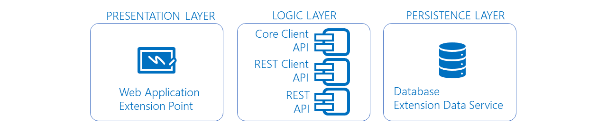
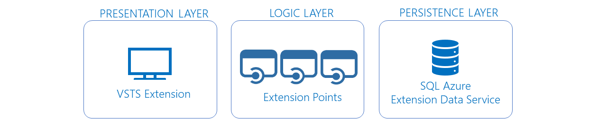
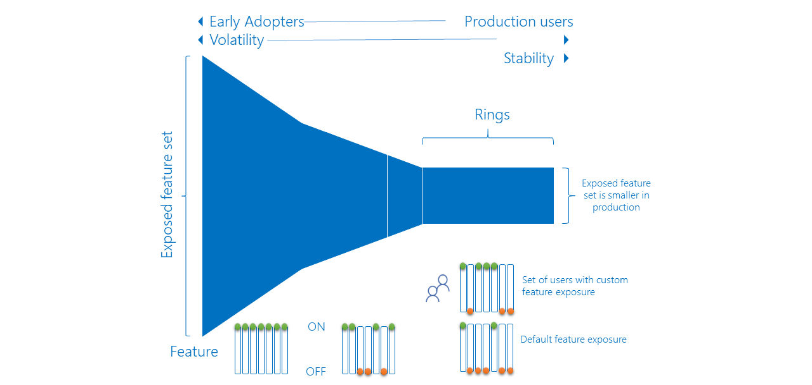

# Explore how to progressively expose your Azure DevOps extension releases in production to validate, before impacting all users

In today's fast-paced, feature-driven markets, it's important to continuously deliver value and receive feedback on features quickly and continuously. Partnering with end users to get early versions of features vetted out is valuable.

Are you planning to build and deploy Azure DevOps extensions to production? You probably have a few questions, such as:
* How do you embrace DevOps to deliver changes and value faster?
* How do you mitigate the risk of deploying to production?
* How do you automate the build and deployment?

This topic aims to answer these questions and share learnings using rings with Azure DevOps extensions. For an insight into the Microsoft guidelines, read [Configuring your release pipelines for safe deployments](https://blogs.msdn.microsoft.com/visualstudioalm/2017/04/24/configuring-your-release-pipelines-for-safe-deployments/).

## One or more rings to rule your deployments

Deployment rings were first discussed in [Jez Humble's book](https://www.continuousdelivery.com/). They support the production-first DevOps mindset and limit impact on end users, while gradually deploying and validating changes in production. Impact (also called **blast radius**), is evaluated through observation, testing, analysis of telemetry, and user feedback.

## Considerations

Before you convert your deployment infrastructure to a ringed deployment model, it's important to consider:
* Who are your primary types of users? For example, early adopters and users.
* What's your application topology?
* What's the value of embracing ringed deployment model?
* What's the cost to convert your current infrastructure to a ringed deployment model?

## User types

In the shown example, users fall into three general buckets in production:

* **Canaries** who voluntarily test bleeding edge features as soon as they are available.
* **Early adopters** who voluntarily preview releases, considered more refined than the canary bits.
* **Users** who consume the products, after passing through canaries and early adopters.

> [!NOTE]
>
> It's important to weigh out which users in your value chain are best suited for each of these buckets. Communicating the opportunity to provide feedback, as well as the risk levels at each tier, is critical to setting expectations and ensuring success.

## Application topology

Next you need to map the topology of your application to the ringed deployment model. Limit the impact of change on end users and to continuously deliver value. Value includes both the value delivered to the end user and the value (return-on-investment) of converting your existing infrastructure.

> [!NOTE]
>
> The ringed deployment model is not a silver bullet!
> Start small, prototype, and continuously compare impact, value, and cost.

At the application level, the composition of Azure DevOps extensions is innocuous, easy to digest, scale, and deploy independently. Each extension:
* Has one of more web and script files
* Interfaces with Core client
* Interfaces with REST client and REST APIs
* Persists state in cache or resilient storage

At the infrastructure level, the extensions are published to the [Visual Studio marketplace](https://marketplace.visualstudio.com). Once installed in organization, they are hosted by the Azure DevOps service portal, with state persisted to Azure storage and/or the extension [data storage](/azure/devops/extend/develop/data-storage).

The extension topology is perfectly suited for the ring deployment model and to publish the extension to each deployment ring:
*  A **private** development version for the canary ring
*  A **private** preview version for the early adopter ring
*  A **public** production version for the Users ring

> [!TIP]
>
> By publishing your extension as private, you're effectively limiting and controlling their exposure for users you explicitly invite. 

## Moving changes through deployment rings

Let's observe how a change triggers and moves through the ring-based deployment process, using the [Azure DevOps Developer Tools Build Tasks](https://marketplace.visualstudio.com/items?itemName=ms-devlabs.vsts-developer-tools-build-tasks) extension.

**Azure DevOps Developer Tools Build Tasks** extension is the secret sauce, used to package and publish Azure DevOps extensions to the Visual Studio Marketplace.
 

1. A developer from the [Countdown Widget extension](https://marketplace.visualstudio.com/items?itemName=ms-devlabs.CountdownWidget) project commits a change to the [GitHub](https://github.com/ALM-Rangers/Countdown-Widget-Extension) repository.

2. The commit triggers a continuous integration build.
3. The new build triggers a continuous deployment trigger, which automatically starts the **Canaries** environment deployment.
4. The **Canaries** deployment publishes a private extension to the marketplace and shares it with predefined organizations. Only the **Canaries** are impacted by the change.
5. The **Canaries** deployment triggers the **Early Adopter** environment deployment. A pre-deployment approval gate requires any one of the authorized users to approve the release.

	

6. The **Early Adopter** deployment publishes a private extension to the marketplace and shares it with predefined organizations. Both the **Canaries** and **Early Adopter** are impacted by the change.
7. The **Early Adopter** deployment triggers the **Users** environment deployment. A stricter pre-deployment approval gate requires all of the authorized users to approve the release.

	

8. The **Users** deployment publishes a public extension to the marketplace. At this stage, everyone who has installed the extension in their organization is affected by the change.
9. It's key to realize that the impact ("blast radius") increases as your change moves through the rings. Exposing the change to the **Canaries** and the **Early Adopters**, is giving two opportunities to validate the change and hotfix critical bugs before a release to production.

> [!NOTE]
>
> Review [CI/CD Pipelines](https://aka.ms/cicdpipelines) and [Approvals](/azure/devops/pipelines/release/approvals/index) for detailed documentation of pipelines and the approval features for releases.

## Dealing with monitoring and noise

You need **effective** monitoring and **actionable** alerts to detect and mitigate issues. Determine what type of data is important, for example infrastructure issues, violations, and feature usage. Focus on actionable alerts to avoid users ignoring them and missing high priority issues.

> [!TIP]
> Start with high-level views of your data, visual dashboards that you can watch from afar, and drill-down as needed. Perform, regular housekeeping of your views and remove all noise. A visual dashboard tells a far better story than hundreds of notification emails, often filtered and forgotten by email rules.

Using the [Team Project Health](https://marketplace.visualstudio.com/items?itemName=ms-devlabs.TeamProjectHealth) and out-of-the-box extensions you can build overview of your pipelines, lead and cycle times, and other information. In the sample dashboard, it's evident that there are 34 successful builds, 21 successful releases, 1 failed release, and 2 releases in progress.

# What's the value?

Using a ring-deployment strategy you can gather feedback to validate your hypothesis. You can decommission old releases and distribute new releases without the risk of affecting all users. 

Here's a summary of how the ALM | DevOps Ranger engineering process evolved with ring deployment models.

| Before using Rings |   | With Rings |
|--------------------|:-:|-----------:|
|Manual and error prone|Build|Automated and consistent|
|Manual and error prone|Release|Automated and consistent|
|Hours|Time to build (TTB)|Seconds|
|Days|Time to release (TTR)|Minutes|
|Call from user|Issue detection|Proactive|
|Days to weeks|Issue resolution|Minutes to days|

Key takeaways:
* Consistent and reliable automation
* Reduced response times
* Canaries experience the pain, not the users

## Is there a dependency on feature flags?

No, rings and feature flags are symbiotic. Feature flags give you fine-grained control of features included in your change. For example, if you're not fully confident about a feature you can use feature flags to **hide** the feature in one or all of the deployment rings. For example, you could enable all features in the canaries ring, and fine-tune a subset for the early adopters and production users, as shown. See [Feature Flags or Rings](https://aka.ms/vsar-rings-flags) for more information.

[LaunchDarkly](https://launchdarkly.com/microsoft/) provides an extension for Azure DevOps Services & Team Foundation Server. It integrates with Azure Pipelines and gives you "run-time" control of features deployed with your ring deployment process.

## Conclusion

Now that you've covered the concepts of rings, you should be confident to explore ways to improve your CI/CD pipelines. While the use of rings adds a level of complexity, having a game plan to address feature management and rapid customer feedback is invaluable.

## Q&A

### How do you know that a change can be deployed to the next ring?

Your goal should be to have a consistent checklist for the users approving a release. See [aka.ms/vsarDoD](https://aka.ms/vsarDoD) for an example definition of done checklist.

### How long do you wait before you push a change to the next ring?

There is no fixed duration or "cool off" period. It depends on how long it takes for you to complete all release validations successfully.

### How do you manage a hotfix?

The ring deployment model allows you to process a hotfix like any other change. The sooner an issue is caught, the sooner a hotfix can be deployed, with no impact to downstream rings.

### How do you deal with variables that span (shared) release environments?

Refer to [Default and custom release variables](/azure/devops/pipelines/release/variables).

### How can you manage secrets used by the pipeline?

Refer to [Azure Key Vault](https://azure.microsoft.com/services/key-vault/) to safeguard cryptographic keys and other secrets used by your pipelines.

##Reference information
* [CI/CD pipeline examples](https://blogs.msdn.microsoft.com/visualstudioalmrangers/tag/cicd-pipeline/)
* [Configuring your release pipelines for safe deployments](https://blogs.msdn.microsoft.com/visualstudioalm/2017/04/24/configuring-your-release-pipelines-for-safe-deployments/)
* [DevOps @ Microsoft](https://aka.ms/devops)

> Authors: Josh Garverick, Willy Schaub | Find the origin of this article and connect with the ALM | DevOps Rangers [here](https://github.com/ALM-Rangers/Guidance/blob/master/README.md)
 
*(c) 2017 Microsoft Corporation. All rights reserved. This document is
provided "as-is." Information and views expressed in this document,
including URL and other Internet Web site references, may change without
notice. You bear the risk of using it.*

*This document does not provide you with any legal rights to any
intellectual property in any Microsoft product. You may copy and use
this document for your internal, reference purposes.*
