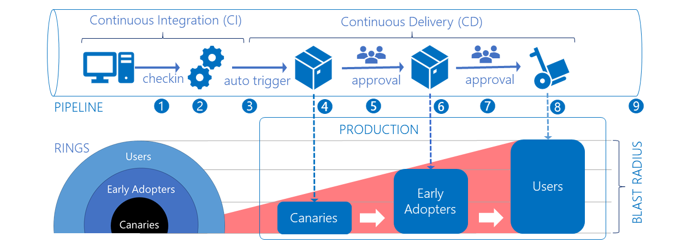
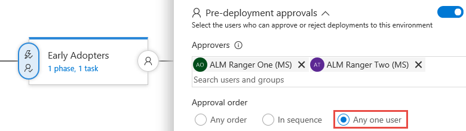
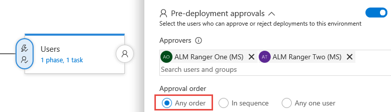
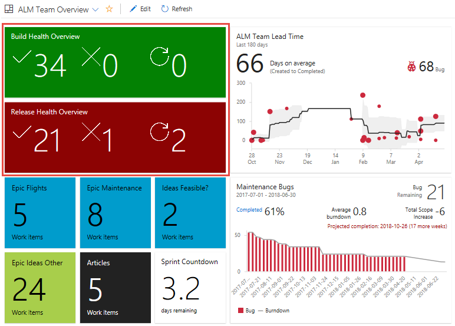

# Phase the roll-out of your application through rings

In today's fast-paced, feature-driven markets, it is imperative to be able to deliver value and receive feedback on features quickly and continuously. Partnering with end-users to get early versions of features vetted out is extremely valuable.

Are you planning to build and deploy Visual Studio Team Services (VSTS) extensions to production? You probably have a few questions, such as:
- How do you embrace DevOps to deliver changes and value faster?
- How do you mitigate the risk of deploying to production?
- How do you automate the build and deployment?

This topic aims to answer this and share our implementation of tiers, or rings, within our production infrastructure for DevLabs extensions. For an insight into the guidelines we follow in Microsoft, please read [Configuring your release pipelines for safe deployments](https://blogs.msdn.microsoft.com/visualstudioalm/2017/04/24/configuring-your-release-pipelines-for-safe-deployments/).

## One or more rings to rule your deployments

Deployment rings are one of DevOps practices used to limit impact on end-users, while gradually deploying and validating change in production. The impact, sometimes called the "blast radius", is typically be evaluated through observation, testing, diagnosis of telemetry, and most importantly, user feedback.

## Considerations

Before you convert your deployment infrastructure to a ringed deployment model, it's important to consider the following:
- Who are your primary types of users? For example early adopters and users.
- What's your application topology?
- What's the value of embracing ringed deployment model?
- What's the cost to convert your current infrastructure to a ringed deployment model?

## User types

Our users fall into three general buckets in production:

- **Canaries** who voluntarily test bleeding edge features as soon as they are available.
- **Early adopters** who voluntarily preview releases, considered more refined than the canary bits.
- **Users** who consume our products, after passing through canaries and early adopters.

> [!NOTE]
> It’s important to weigh out which users in your value chain are best suited for each of these buckets. Communicating the opportunity to provide feedback, as well as the risk levels at each tier, is critical to setting expectations and ensuring success.

## Application topology

Next you need to map the topology of your application to the ringed deployment model. Remember, we want to limit the impact of change on end-users and to continuously deliver value. Value includes both the value delivered to the end-user and the value (return-on-investment) of converting your existing infrastructure.

> [!NOTE]
> The ringed deployment model is not a silver bullet!
> Start small, prototype, and continuously compare impact, value, and cost.

At the application level, the composition of our extensions is innocuous, easy to digest, scale, and deploy independently. Each extension has one of more web and script files, interfaces with Core client, REST client, and REST APIs, and persists state in cache or resilient storage.

At the infrastructure level, the extensions are published to the [Visual Studio marketplace](https://marketplace.visualstudio.com). Once installed in VSTS accounts, they are hosted by the VSTS web application, with state persisted to Azure storage and/or the extension [data storage](/vsts/extend/develop/data-storage).

The extension topology is perfectly suited for the ring deployment model and we publish a version of each extension for each deployment ring:
-  A private **DEV**elopment version for your canary ring
-  A private **BETA** version for the early adopter ring
-  A public **PROD**uction version for the public production ring

> [!TIP]
> By publishing your extension as private, you're effectively limiting and controlling their exposure for users you explicitly invite. 

## Moving changes through our ring-based deployment process

Let's observe how a change triggers and moves through our ring based deployment process we're using for all our extension projects, using the [VSTS Developer Tools Build Tasks](https://marketplace.visualstudio.com/items?itemName=ms-devlabs.vsts-developer-tools-build-tasks) extension.

> **VSTS Developer Tools Build Tasks** extension is our secret sauce, used to package and publish VSTS extensions to the Visual Studio Marketplace.
 

1. A developer from the [Countdown Widget extension](hhttps://marketplace.visualstudio.com/items?itemName=ms-devlabs.CountdownWidget) project commits a change to the [GitHub](https://github.com/ALM-Rangers/Countdown-Widget-Extension) repository.

2. The commit triggers a continuous integration build.
3. The new build triggers a continuous deployment trigger, which automatically starts the **Canaries** environment deployment.
4. The **Canaries** deployment publishes a private extension to the marketplace and shares it with predefined VSTS accounts. At this point only the **Canaries** are impacted by the change.
5. The **Canaries** deployment triggers the **Early Adopter** environment deployment. This time we have a pre-deployment approval gate, which requires any one of the authorized users to approve the release.

	

6. The **Early Adopter** deployment publishes a private extension to the marketplace and shares it with predefined VSTS accounts. At this point both the **Canaries** and **Early Adopter** are impacted by the change.
7. The **Early Adopter** deployment triggers the **Users** environment deployment. This time we have a stricter pre-deployment approval gate, which requires all of the authorized users to approve the release.

	

8. The **Users** deployment publishes a public extension to the marketplace. At this stage, everyone who has installed the extension in their VSTS account is affected by the change.
9. It's key to realize that the impact ("blast radius") increases as your change moves through the rings. Exposing the change to the **Canaries** and the **Early Adopters**, is giving us two opportunities to validate the change and hotfix critical bugs before we release to production.

> [!NOTE]
> Review [CI/CD Pipelines](https://aka.ms/cicdpipelines) and [Approvals](/vsts/build-release/concepts/definitions/release/approvals/index) for detailed documentation of our pipelines and the approval features for release management.

## Dealing with monitoring and noise

To detect and mitigate issues, learn from tracking usage, "test in production", determine cost and value, you need **effective** monitoring. Determine what type data is important, for example infrastructure issues, violations, and feature usage. Avoid noisy alerts which get ignored, or drown out alerts for higher priority issues.

> [!TIP]
> Start with high-level views of your data, visual dashboards that you can watch from afar, and drill-down as needed. Perform, regular housekeeping of your views and remove all noise. A visual dashboard tells a far better story than hundreds of notification emails, often filtered and forgotten by email rules.

Here are a few examples of visual dashboards we use to "spot" the anomalies, the unexpected, and the overall health of our pipelines within the ring deployment model.

Using the [Team Project Health](https://marketplace.visualstudio.com/items?itemName=ms-devlabs.TeamProjectHealth) and out-of-the-box extensions extension we have an overview of our pipeline builds and releases, as well as lead and cycle time trends. It's evident that we have 33 successful builds, 1 failed build, 12 successful releases, and 12 releases in progress.

Another dashboard gives us a visual view of all the release. The visual indicators and colours allow us to glance at these dashboards from afar. In fact, we only react if we see the **X** counters increment or parts of the dashboard turning **red**.

If you're looking for more detail you can use the build overview. We have a healthy code coverage, happy tests, and the BETA ring deployment is in progress.

You're able to continue the drill-down from visual cue to detailed telemetry. Using Application Insights you can drill into live metrics, smart detection, and usage telemetry.

## What's the value?

The return on investment and ongoing value we get from the ring deployment model is astounding, especially considering our challenging environment. Our engineers are all part-time volunteers, geographically distributed around the globe, with limited bandwidth, and constantly challenged with a variety of time zones injecting latency into our process.

Here's a summary of how our engineering process has evolved since we have introduced ring deployment models.

We achieved consistent and reliable automation, we reduced all response times, we removed all error prone manual intervention, and our users are happy. Here's a recent example response from the marketplace that sums it all up" "*Development team is quick to respond to bug fixes!*".

## Is there a dependency on feature flags?

No, rings and feature flags are symbiotic. Feature flags give you fine-grained control of features included in your change. For example, if you're not fully confident about a feature you can use feature flags to **hide** the feature in one or all of the deployment rings. For example, you could enable all features in the canaries ring, and fine-tune a subset for the early adopters and production users, as shown.

[LaunchDarkly](https://launchdarkly.com/microsoft/) provides an extension for VSTS & Team Foundation Server. It integrates with VSTS RM and gives you "run-time" control of features deployed with your ring deployment process.

## Conclusion

Now that you've covered the concepts and considerations of rings, and our implementation of rings, you should be confident to explore ways to improve your CI/CD pipelines. While the use of rings adds a level of complexity, having a game plan to address feature management and rapid customer feedback is invaluable.

## Q&A

### How do we know that a change can be deployed to the next ring?

Your goal should be to have a consistent checklist for the users approving a release. See [aka.ms/vsarDoD](https://aka.ms/vsarDoD) for an example definition of done checklist.

### How long do we wait before we push a change to the next ring?

There is no fixed duration or "cool off" period. It depends on how long it takes for you to complete all release validations successfully. In our environment changes are automatically delivered to the **Canaries** and as quickly as possible to the **Early Adopters**. Our objective is to gather telemetry and feedback from **Canaries** and **Early Adopters**, working in different and geographically distributed environments as quickly as possible.

### How do you manage a hotfix?

The ring deployment model allows you to process a hotfix like any other change. The sooner an issue is caught, the sooner a hotfix can be deployed, with no impact to downstream rings.

### How do we deal with variables that span (shared) release environments?

Refer to [Variables in Release Management](/vsts/build-release/concepts/definitions/release/variables).

### How can we manage secrets used by the pipeline?

Refer to [Azure Key Vault](https://azure.microsoft.com/en-us/services/key-vault/) to safeguard cryptographic keys and other secrets used by your pipelines.

##Reference information
- [Configuring your release pipelines for safe deployments](https://blogs.msdn.microsoft.com/visualstudioalm/2017/04/24/configuring-your-release-pipelines-for-safe-deployments/)
- [CI/CD pipeline examples](https://blogs.msdn.microsoft.com/visualstudioalmrangers/tag/cicd-pipeline/)

> Authors: Josh Garverick, Willy Schaub | Find the origin of this article and connect with the ALM Rangers [here](https://github.com/ALM-Rangers/Guidance/blob/master/README.md)
 
*(c) 2017 Microsoft Corporation. All rights reserved. This document is
provided "as-is." Information and views expressed in this document,
including URL and other Internet Web site references, may change without
notice. You bear the risk of using it.*

*This document does not provide you with any legal rights to any
intellectual property in any Microsoft product. You may copy and use
this document for your internal, reference purposes.*
