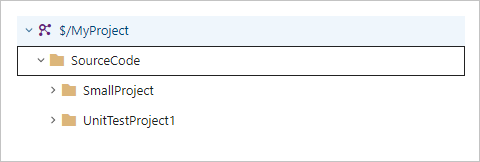
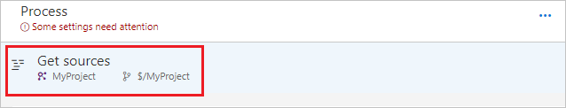
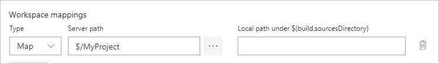
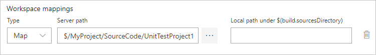
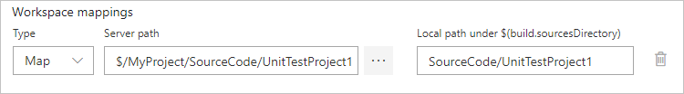

# Test Impact for partially mapped TFVC repositories in TFS/Azure DevOps Services

#### Azure DevOps Services | TFS 2018 | TFS 2017 Update 1

Test Impact Analysis (TIA) has been part of VSTest task starting with version 2. This feature helps speed up the DevOps cycle by helping you run only relevant tests for a build. Effectively, you end up running tests which are affected by incoming changes and not the entire test suite. For more information about Test Impact Analysis, see [Accelerated Continuous Testing with Test Impact Analysis - Part 1](https://blogs.msdn.microsoft.com/devops/2017/03/02/accelerated-continuous-testing-with-test-impact-analysis-part-1/). 

In addition to supporting GitHub and Git in TFS/Azure DevOps Services, TIA also supports TFVC. This article describes a known limitation about TIA in build/release pipelines based on TFVC and a work around to get past this limitation. 

## Issue with partially mapped TFVC repositories 

The way TIA works is by collecting data on the files that a test method touches during its first run, also called the base line run. The collector which collects this data has visibility only of the enlisted repository on the agent machine. With TFVC based pipelines, you get an option to enlist partial repositories. For example, consider a repository that has the following structure.

Now, in your build/release pipeline you see **Get sources** tile under **Process** as shown in the following example. 

Select **Get sources** and you'll see options on the right blade to partially map your repository. 

If you enlist the entire repository, as shown in the previous example, TIA continues to work fine, but if you enlist partially, as shown in the following example, TIA fails to find the impacted tests. 

When a TFVC repository is partially enlisted, TIA fails to find the impacted tests because the collector is able to collect changes only for the partially enlisted repository on the agent and does not have visibility of the entire path. When a code change flows in from the server, it provides the entire path, and the matching attempt with the mapped path fails.

## Workaround 
To work around this issue, you can map your partial repository to the complete code structure on the server, so that the full path of the files on your local enlistment match the full server path. To do this, you can specify a **Local path** that matches the server path, as shown in the following example.

This ensures that the server path matches the path collected by the collector and impacted tests are correctly listed. 

 