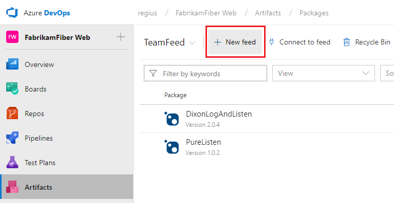
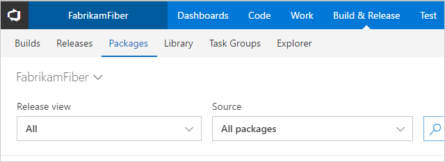

A feed is a container for packages.
You consume and publish packages through a particular feed.

::: moniker range=">= azure-devops-2019"

1. Go to **Azure Artifacts**:

   > [!div class="mx-imgBorder"] 
   >
   > 

1. Select **+ New feed**:

   > [!div class="mx-imgBorder"] 
   >
   > 

1. In the dialog box:

   - Give the feed a name.
   - Choose who can read and contribute (or update) packages in your feed.
   - Choose the upstream sources for your feed.
   - When you're done, select **Create**.

   Most of the default settings work great for most feed users. Making your feed organization visible means you can share a single source of packages across your entire team. Enabling [upstream sources](../concepts/upstream-sources.md) to public sources makes it easy to use your favorite OSS packages. Enabling upstream sources can also give you more protection against outages and corrupted or compromised packages.

   > [!div class="mx-imgBorder"] 
   >
   > 

::: moniker-end

::: moniker range="< azure-devops-2019"

1. Go to the **Packages** page:

    

1. Select **+ New feed**:

    

1. In the dialog box:

   - Give the feed a name.
   - Choose who can read and contribute (or update) packages in your feed.
   - Choose the upstream sources for your feed.
   - When you're done, select **Create**.

   Most of the default settings work great for most feed users. Making your feed organization visible means you can share a single source of packages across your entire team. Enabling [upstream sources](../concepts/upstream-sources.md) to public sources makes it easy to use your favorite OSS packages. Enabling upstream sources can also give you more protection against outages and corrupted or compromised packages.

   

::: moniker-end

You can change these settings later by [editing the feed](../feeds/edit-feed.md).
