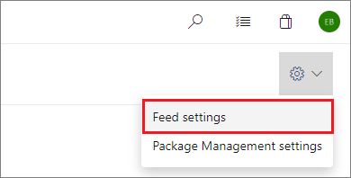
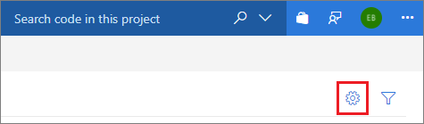

With your feed selected, select **Edit feed** (the gear icon).

::: moniker range="vsts"

# [New navigation](#tab/new-nav)
> [!div class="mx-imgBorder"] 
>
> 

# [Previous navigation](#tab/previous-nav)

---

::: moniker-end

::: moniker range=">= tfs-2017 < vsts"

::: moniker-end

