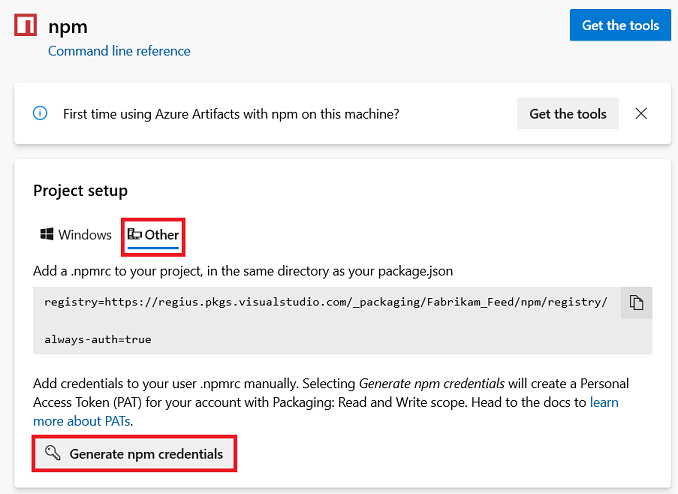

The _Connect to feed_ dialog will generate an appropriately-formatted token that you can place into your **_.npmrc_** file with a lifespan of 90 days.

>  If you want to create a token that lasts _longer than 90 days_, skip to the second method below.

**90-day token:**

::: moniker range="vsts"

1. From **Azure Artifacts**, select _Connect to feed_

1. Select _npm_.

1. Click _Generate npm credentials_ and copy them to add them to your user **_.npmrc_** manually:

    # [New navigation](#tab/new-nav)
    > [!div class="mx-imgBorder"] 
    >
    > 

    # [Previous navigation](#tab/previous-nav)
    

   ---

::: moniker-end

::: moniker range=">=tfs-2017 < vsts"

1. From the **Packages** page, select _Connect to feed_

1. Select _npm_.

1. Click _Generate npm credentials_ and copy them to add them to your user **_.npmrc_** manually:

    

::: moniker-end

**Create a token that lasts longer than 90 days:**

1. Navigate to security and generate a [PAT](../../../organizations/accounts/use-personal-access-tokens-to-authenticate.md) with a narrow scope of "Packaging (read and write)".
2. Base64 encode the PAT.

    # [Windows](#tab/windows)
    ```powershell
    [Convert]::ToBase64String([system.Text.Encoding]::UTF8.GetBytes("YOUR_PAT_GOES_HERE"))
    ```

    # [Mac](#tab/mac)
    ```
    echo -n "YOUR_PAT_GOES_HERE" | base64
    ```
   ---


3. In your $home/.npmrc add the following lines replacing `yourorganization` and `yourfeed`, and adding your username (can be anything except empty), PAT, and email.

    ```json
    //pkgs.dev.azure.com/<yourorganization>/_packaging/<yourfeed>/npm/registry/:username=ANYTHING-BUT-EMPTY
    //pkgs.dev.azure.com/<yourorganization>/_packaging/<yourfeed>/npm/registry/:_password=BASE64-ENCODED-PAT-GOES-HERE
    //pkgs.dev.azure.com/<yourorganization>/_packaging/<yourfeed>/npm/registry/:email=YOUREMAIL@EXAMPLE.COM
    //pkgs.dev.azure.com/<yourorganization>/_packaging/<yourfeed>/npm/registry/:always-auth=true
    ```
