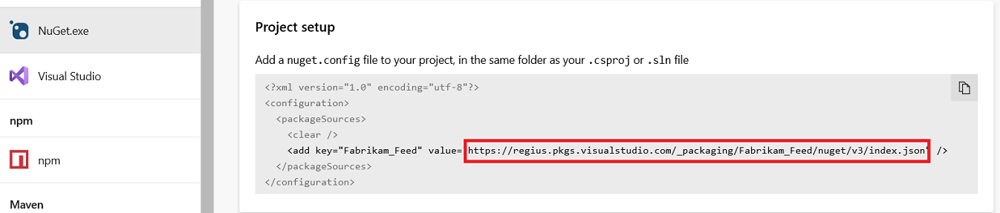

::: moniker range="azdevops"

1. Go to your feed ([or create a feed if you haven't](../../feeds/create-feed.md)). 

1. Select **Connect to feed**:

    # [New navigation](#tab/new-nav)
    > [!div class="mx-imgBorder"] 
    >
    > 

    # [Previous navigation](#tab/previous-nav)
    

   ---
   
1. Copy the NuGet package source URL:

    # [New navigation](#tab/new-nav)
    > [!div class="mx-imgBorder"] 
    >
    > 

    # [Previous navigation](#tab/previous-nav)
    

   ---

::: moniker-end

::: moniker range=">=tfs-2017 < azdevops"

1. Go to your feed ([or create a feed if you haven't](../../feeds/create-feed.md)). 

1. Select **Connect to feed**:

    
   
1. Copy the NuGet package source URL:

    

::: moniker-end
   

