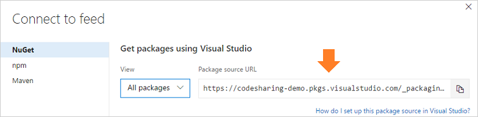

::: moniker range=">= azure-devops-2019"

1. Go to your feed ([or create a feed if you haven't](../../feeds/create-feed.md)). 

1. Select **Connect to feed**:

   > [!div class="mx-imgBorder"] 
   >
   > 
   
1. Copy the NuGet package source URL:

   > [!div class="mx-imgBorder"] 
   >
   > 

::: moniker-end

::: moniker range=">=tfs-2017 < azure-devops-2019"

1. Go to your feed ([or create a feed if you haven't](../../feeds/create-feed.md)). 

1. Select **Connect to feed**:

   
   
1. Copy the NuGet package source URL:

   

::: moniker-end
