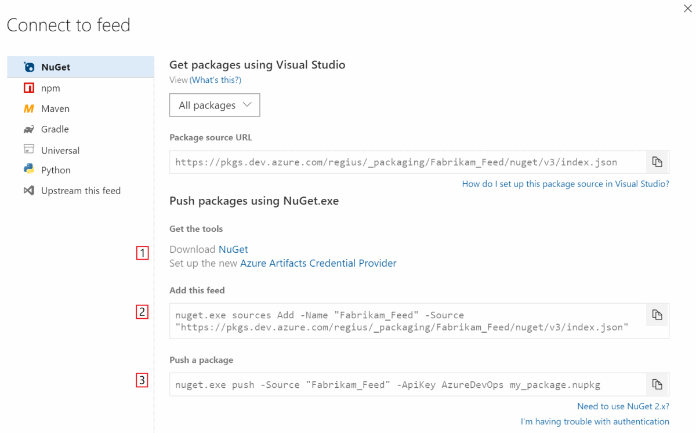

::: moniker range=">= azure-devops-2019"

1. Go to your feed ([or create a feed if you haven't](https://docs.microsoft.com/en-us/azure/devops/artifacts/get-started-nuget?view=azure-devops&tabs=new-nav#create-a-feed)). 

1. Select **Connect to feed**:

   > [!div class="mx-imgBorder"] 
   >
   > 

1. Follow steps 1, 2, and 3 to get the tools, add the feed to your local NuGet configuration, and push the package.

   > [!div class="mx-imgBorder"] 
   >
   > 

::: moniker-end

::: moniker range=">=tfs-2017 < azure-devops"

1. Go to your feed ([or create a feed if you haven't](../../feeds/create-feed.md)). 

1. Select **Connect to feed**:

   

1. Follow steps 1, 2, and 3 to get the tools, add the feed to your local NuGet configuration, and push the package.

   

::: moniker-end
   
