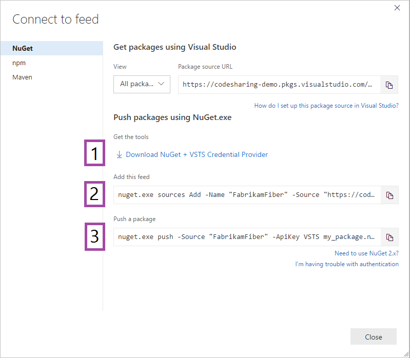

1. Navigate to your feed ([or create a feed if you haven't](../../feeds/create-feed.md)). 

1. Select **Connect to feed**:

   

1. Follow steps 1, 2, and 3 to get the tools, add the feed to your local NuGet configuration, and push the package.

   
